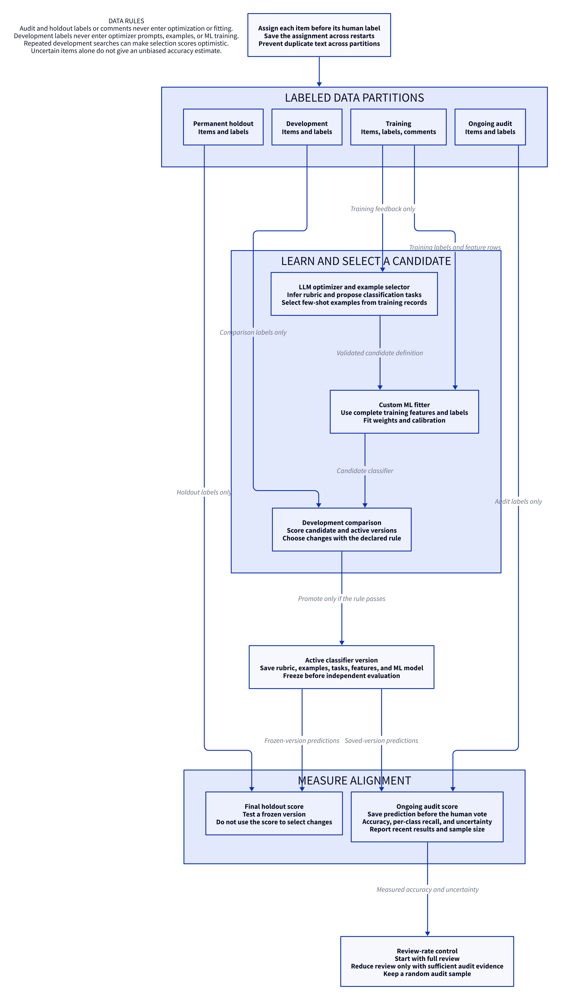

# Decision Flywheel

Decision Flywheel is a reusable Python library for decisions that improve with human feedback.
The human supplies labels and optional explanations.
An LLM optimizer uses this feedback to propose changes to the decision rubric.
The decision model answers the rubric questions.
A fitted ML model uses those answers to predict the final label.
Code measures each change before it replaces the active version.

The flywheel improves two parts of the classifier.
The LLM optimizer adjusts the rubric and defines the classification tasks for the decision model.
It sets each task's question, answer options, and criteria. It also selects labeled examples.
The ML fitter learns how to combine the answers from the decision model.
Human feedback supplies the evidence for both changes.

## Design and implementation status

The diagrams below show the intended complete system.
They define the work that the library must support.
They do not prove that the current reviewer runs all these steps.

The live reviewer now calls the reusable `DecisionFlywheel` core.
The core analyzes eligible votes and comments, validates proposals, collects Jev features,
fits and calibrates the ML head, compares development results, and promotes or rejects a version.
Private SQLite records preserve the active version, request cache, and actual transcripts.

Export a private, offline debugging recording:

```bash
python -m decision_flywheel.trace_artifact --database var/reviewer-runtime.sqlite3 --output var/reviewer-trace.html
python -m decision_flywheel.trace_server --viewer var/reviewer-trace.html
```

Open `http://127.0.0.1:8780` in a browser. The server binds only to loopback,
serves only the selected HTML file, disables caching, and makes no model calls.
It never exposes neighboring databases or credentials. Stop it with Ctrl+C.
Previous/Next and the timeline step through
events. The bundled vis-timeline 8.5.4 view separates human feedback, rubric,
few-shot examples, classifier questions, ML optimization, fitting, and evaluation.
Feedback markers retain arbitrary label values, partition roles, comments, and
retractions. Click markers to inspect events; pan/zoom to compare recorded rounds.
Individual request, response, proposal, evaluation and activation markers open
an event-only inspector. Compact summaries show feedback, rationale, proposed
configuration changes and metric comparisons. Full prompts, responses, expanded
decision requests, configuration snapshots and untouched raw JSON are behind
explicit expand controls. Nothing from another event is displayed as the selected
event's exchange. Label-value, partition and comment filters change only the
timeline view, never the recording. Returned tool calls do not by themselves
prove tool execution.
Response markers link directly to their matching optimizer request, which opens
the exact full messages. Selected demonstrations in that request are resolved
against its recorded feedback context and displayed with labels and content.
Decision request markers display actual expanded examples; decision response
markers show the classifications. The timeline uses chronological ordinal steps,
not a calendar axis. Prediction and human-label lanes share compact class symbols
and labeled class rows, with confidence and content in drill-down details.
Close details to expand the timeline to full width; select a marker to reopen
the adjacent inspector, or use Show details to restore the last selection. Non-stacking lanes
grow to fit all rows without internal vertical scrolling. Drag the background to pan,
use ordinary scroll over the timeline or Zoom buttons to zoom without modifier keys,
drag the background to pan,
and drag the native playback pointer to
inspect a step. Previous/Next moves chronologically across labels, predictions and
optimization records; the window follows an off-screen pointer without changing
its zoom. Zoom stays between one step and recorded history; run/history buttons
distinguish the optimization window. Original timestamps remain in source records.

Pass `--reviews var/reviewer.sqlite3` to include the original human actions and
pre-vote prediction presentations as a separate source-history layer. It reads
the database without writes; source records retain their original timestamps and
provenance, never masquerading as new replay events. A run with no few-shot or
question optimization has no such lane; the UI does not invent those experiments.
Only timestamped recorded events are plotted: absent historical labels are not
invented. The dependency is bundled under MIT with its license notices, without
CDN calls. Previous/Next and the event slider step through
events; Play/Pause replays a selected range; the round selector jumps to a recorded
optimization step. Each event exposes its exact prompt, response or other payload.
Measured comparisons show incumbent/candidate metrics and accuracy differences;
unmeasured steps explicitly show no established accuracy change. New step and
activation events retain full configuration and fitted-head snapshots. Old events
cannot recover snapshots that were never recorded. Playback does not optimize,
retrain, call any service or modify the runtime. The recording contains private
feedback and article content: keep it local, never commit it or publish it.

Decision answers use an exact-request cache by default. Its fingerprint includes
the model identity and complete state/questions: target, rubric, ordered examples,
and extra classifications. Changed requests require new answers; retraining a head
alone can reuse unchanged decision answers.

```python
from decision_flywheel.decision_cache import CacheOptions

# Default: reuse complete answers, collect missing ones.
answer = await wheel.predict(item, training)
# No new decision-model calls; raises CacheMiss if unavailable.
answer = await wheel.predict(item, training, cache_options=CacheOptions("cache_only"))
# Explicitly collect again and preserve the previous answer in SQLite history.
answer = await wheel.predict(item, training, cache_options=CacheOptions("refresh"))
```

Constructor `cache_options` supplies the default for all decision collection.
Failed or interrupted attempts require separate `retry_failed=True` permission;
refresh alone does not authorize retrying an ambiguous paid call. Request ceilings
still apply. Cache events are available in the normal trace. These options control
decision collection, not optimizer calls or replay of completed optimization rounds.
There is no automatic expiration or approximate-text reuse.
Offline tests cover this connected path. A successful paid live demonstration is a separate verification step;
passing tests does not establish live-model quality or improvement.

| Part | Current state |
| --- | --- |
| Human votes, comments, skip, and undo | Available in the reviewer |
| Fixed example selection | Optimizer proposes a list; code validates it and measures the candidate |
| LLM analysis of feedback | Injected optimizer interface; opt-in OpenAI transport |
| Rubric and classification-task changes | Validated structured proposals, applied to the actual request |
| Feature conversion and ML fit | Connected to the core; trusted fitting and out-of-fold calibration |
| Candidate evaluation and promotion | Same-development Brier comparison; incumbent retained on failure |
| Optimizer and Jev inspection | Actual local prompts, replies, tool calls, request state/questions and answers |
| Live performance | Must be measured; no guaranteed improvement |

## Terms

Use these terms with the same meaning throughout the system.

| Term | Meaning |
| --- | --- |
| Item | One article or other record to classify |
| Label | The human's final decision for an item |
| Feedback | A label, an optional comment, and the prediction shown before the vote |
| Rubric | The criteria that explain which label an item should receive |
| Decision element | One question or programmatic input in the scorecard |
| Scorecard | The saved set of decision elements and their definitions |
| Decision model | A model, such as Jev, that answers the scorecard questions |
| Feature | A numerical input derived from a decision-element answer |
| ML model | The fitted decision head that maps features to a final prediction |
| LLM optimizer | The agent that analyzes feedback and proposes structural changes |
| Candidate | A proposed version that has not passed its evaluation |
| Active version | The saved version used for current predictions |
| Development set | Labeled items used to compare candidates |
| Audit set | Labeled items used to measure alignment outside the optimization loop |

## The classifier at the center of the flywheel

<picture>
  <source media="(prefers-color-scheme: dark)" srcset="docs/diagrams/classifier-dark.png">
  
</picture>

[Editable D2 source](docs/diagrams/classifier.d2)

The request contains the new item in `state.target`.
It contains three adjustable parts:

- `state.rubric`: criteria for the main Include or Exclude decision.
- `state.examples`: the selected collection of labeled few-shot examples.
- `questions`: the main decision and optimizer-defined element classification tasks.

The main question starts as “Should this item be included?”
Its instructions can refer to the evolving rubric in `state.rubric`.
The optimizer experiments with the example collection and the element tasks.
Each element task defines its question, answer options, and criteria.
The main answer and element answers become features for the custom ML model.
Per-item example retrieval is a later exploration.

This classifier generalizes the mechanism demonstrated in Jev Flywheel.
The LLM optimizer controls two definitions: the final-label rubric and the decision model's classification tasks.
The rubric describes what the human wants included or excluded.
Each classification task asks the decision model to identify an attribute of the item.
The optimizer can add, remove, or change tasks and their answer options and criteria.
These task answers supply the features for our custom ML model.
They are intermediate classifications. The custom ML model produces the final Include or Exclude label.

For example, the rubric can favor recent papers with practical evaluation methods.
One task can classify the method as practical or theoretical.
Another task can classify the paper's age against the supplied current date.
The fitter learns how these answers relate to the human's labels.

The scorecard defines a holistic question and additional decision-element questions.
Jev answers these questions for the same item in one request.
The feature converter derives named numbers from the answers and their probabilities.
The trained decision head combines these features to predict the final label.
Calibration adjusts the head's confidence.

The holistic Jev answer can be one input to the decision head.
It does not replace the head's final classification.
Additional questions supply evidence that the holistic question can miss.
Human labels determine how the fitted head uses that evidence.

The active version is the saved classifier definition.
It contains the questions, examples, feature rules, fitted weights, and calibration.
It is configuration for the prediction path.
Human review is a separate step after classification.

The proof-of-concept mechanism is visible in
[Jev Flywheel scoring](https://github.com/AnthusAI/Jev-Flywheel/blob/main/jev_flywheel/scoring.py)
and [feature conversion](https://github.com/AnthusAI/Jev-Flywheel/blob/main/jev_flywheel/features.py).
The generalized library must preserve this mechanism through provider adapters.

## Collect human feedback

1. Load the active version.
2. Send the item, rubric questions, and selected examples to the decision model.
3. Convert the answers to numerical features.
4. Apply the fitted ML model to the features.
5. Show the item and its predicted label to the human.
6. Save the prediction before the human supplies a label.
7. Save the label and optional explanation.

For the article study, the labels are `include` and `exclude`.
The interface shows the title, abstract, date, categories, authors, and publication citation when available.
The human can skip an item or undo a vote.
An undo must invalidate dependent candidates and training records when necessary.

The active version contains the scorecard, example policy, feature rules, fitted weights, and calibration.
It also identifies the source model and training data.
These parts must remain together during save, load, and restart operations.

At the start, the system has few labels and no known personal rubric.
It must identify its initial prediction as a baseline.
Initial accuracy is unknown. It is not necessarily poor.
The system needs examples of both labels before it can learn their difference.

## Analyze feedback and improve the system

<picture>
  <source media="(prefers-color-scheme: dark)" srcset="docs/diagrams/improvement-dark.png">
  
</picture>

[Editable D2 source](docs/diagrams/improvement.d2)

The optimizer receives training items, human labels, comments, prediction errors, and the current scorecard.
It searches for criteria that explain the human's decisions.
It states a possible rule and identifies the training feedback that supports it.
The rule is a hypothesis until evaluation supports it.

For example, a human can prefer recent papers about practical evaluation methods.
The optimizer can propose a question about practical evaluation.
It can also propose a `current_datetime` element if the feedback suggests a time-dependent criterion.
This example illustrates a possible change. It is not a finding from the current study.

The optimizer controls three parts of the decision-model request:

- Select better labeled examples for the decision model.
- Revise the main decision's rubric.
- Add, change, or remove element classification tasks and their options and criteria.

Code retrains the custom ML model from the resulting features and trusted labels.

Code validates each proposal against the schema, data rules, feature limits, and request budget.
Code collects missing answers for the candidate questions.
An unchanged request can reuse a saved answer.
A changed question requires a new answer and a new feature identity.

The fitter uses trusted training labels and complete feature rows.
It derives numerical weights from the data.
It accounts for the probability that each training item was selected for review.
It calibrates confidence from out-of-fold predictions.
The optimizer cannot supply weights or calibration values.

Code compares the candidate and active version on the same development items.
It promotes the candidate only if the declared improvement rule passes.
Otherwise, it keeps the active version and records the result.
A promoted version supplies predictions for subsequent items.
Their human feedback starts the next round.

The first article study uses titles and abstracts.
Each request still needs a context-size check that includes its questions and examples.
Optimization of extraction rules for longer articles is deferred.

## Separate learning from evaluation

<picture>
  <source media="(prefers-color-scheme: dark)" srcset="docs/diagrams/evaluation-dark.png">
  
</picture>

[Editable D2 source](docs/diagrams/evaluation.d2)

Assign each item to its data partition before the human supplies a label.
Save the assignment so a restart cannot change it.
Keep partitions disjoint by item identity and normalized text.
An item must not appear among its own examples.

Training records can enter the optimizer prompt, example selection, and ML fit.
Development labels can score candidates. They must not enter the optimizer's feedback briefing or ML fit.
Repeated candidate searches can make development scores optimistic.
Use independent audit data to measure the active version.
Keep permanent holdout labels outside all optimization steps.
Use the permanent holdout for a final test after the version is frozen.

Start with full human review.
Reduce the review rate only when sufficient audit evidence supports the change.
Keep a random audit sample as the review rate decreases.
Errors on uncertain items alone do not give an unbiased accuracy estimate.
Record review-selection probabilities and report the sample size.
Increase review if recent alignment falls or the human's criteria change.

The report must show accuracy, per-class recall, probability quality, and uncertainty.
It must show recent results as well as results across the full study.
It must track votes required, active elements, example counts, training rounds, model requests, latency, and token use.
Report each result with its version and measurement partition.

## Show the optimizer's work

The application must show the latest optimizer exchange and its measured result.
The user must be able to inspect:

- The exact prompt and training feedback supplied to the optimizer.
- The returned response and structured tool calls.
- The proposed rubric rule and question changes.
- The current questions and feature definitions.
- The example list selected for each candidate.
- The ML training status, training counts, and fitted model version.
- The evaluation results and promotion decision.

Show the optimizer's stated explanation. Do not claim access to private model reasoning.
Store transcripts locally because they can contain article text and human comments.
Never put credentials in a prompt, transcript, event record, or committed artifact.

The reusable library emits events that an application can display.
The application does not own a separate optimization loop.
The saved state must preserve progress across restarts.
It must distinguish a completed step, a failed step, and a step that has not run.
It must also show when new feedback makes the active version stale.

## Try the current implementation

The offline commands make no paid calls. The live commands explicitly authorize bounded paid collection.

Create the environment and install the offline dependencies:

```bash
python3 -m venv .venv
.venv/bin/pip install -e '.[dev]'
make PYTHON=.venv/bin/python test
make PYTHON=.venv/bin/python demo
```

The offline demo uses synthetic labels and a fake decision model.
It makes no network calls.
It saves an example-selection artifact and a summary in `demo-output/`.
Its results describe the synthetic fixture, not live-model performance.

Install the reviewer and Jev dependencies:

```bash
.venv/bin/pip install -e '.[reviewer,jev,optimizer]'
```

For a new study, download the article batch and collect votes without paid models:

```bash
.venv/bin/python scripts/seed_arxiv_reviewer.py --output var/arxiv-review.jsonl --limit 250
.venv/bin/python -m decision_flywheel.reviewer --database var/reviewer.sqlite3 --articles var/arxiv-review.jsonl
```

The download uses the public arXiv metadata snapshot. It records the observed Hub revision,
selection parameters and local batch hash. The dataset-server rows endpoint is not revision-pinned.
The saved local batch is reused on later runs, without downloads or overwrites.
Article text, votes and comments remain in ignored `var/` files. Do not publish them.

For an existing study, resume the same queue:

```bash
make PYTHON=.venv/bin/python review-local
```

Use `I` for Include or `E` for Exclude.
Enter an optional comment after the vote.
Use `S` to skip, `B` to undo, and `Q` to quit.
Local mode uses a baseline predictor.

For the connected live labeling demo, start or resume with:

```bash
make PYTHON=.venv/bin/python review
```

This command authorizes at most 500 Jev requests and 10 optimizer requests per session.
The defaults are `DECISIONS_PROVIDER=jev`, `DECISIONS_MODEL=jev-1.13.0`, and
`OPTIMIZER_MODEL=gpt-6-luna`. Override `DECISIONS_PROVIDER`, `DECISIONS_MODEL`, `OPTIMIZER_MODEL`,
`REVIEWER_REQUESTS`, `OPTIMIZER_CALLS`, or `OPTIMIZE_EVERY` in the make command.
`make review-arxiv` reuses or downloads the batch and starts this same **paid live mode**.

The initial rubric is empty. Jev supplies the warm-up prediction; no local replacement head is used.
Fitted-classifier promotion waits for at least three training votes per declared class
and, in the staged reviewer, 20 development votes per class by default. Question
discovery/backfill does not wait for this promotion gate. A permanent ID-hash rule assigns 25% of otherwise eligible records
to development before their labels are known. Existing rolling and final audit roles remain protected.
The demo reviews all displayed items; training review propensities are recorded as 1.0.
Adaptive review-rate reduction remains deferred until there is a validated random-audit rule.

After each 10 new votes, the core runs only the configured stage, **rubric** by
default. Use `G` to request that stage sooner. `N` runs question discovery/backfill;
`X` runs a separate example-selection experiment. A stage makes at most one
optimizer discovery call; it never automatically runs the other discovery stages.
After question backfill, a separate numerical training phase evaluates current
questions and current-plus-retained questions, each with natural and equal-class
fitting. It keeps the rubric and fixed examples unchanged, fits only trusted
training labels with full feature coverage, and calibrates only out of fold.
`M` repeats this training phase without calling the optimizer. Set
`OPTIMIZATION_STAGE=classifier` to schedule it every 10 votes instead of rubric
discovery. The same development-coverage gate applies; backfill alone does not
mean that the new features have been deployed.
Selection minimizes balanced development Brier, requires non-decreasing balanced
accuracy, and rejects any per-class recall regression. The selected fitted
artifact, evidence, metrics, weighting policy and cache state persist across
restarts. `F` shows active features; `J` shows requests; fit and evaluation events
appear as they happen.

The 2026-10-06 experiment used existing labels only: 60 training items (6 Include)
and 27 development items (2 Include). Current-plus-retained questions with
equal-class fitting improved development balanced accuracy from 50% to 75% and
balanced Brier from 0.7755 to 0.4461. It got 26/27 correct, but only 1/2 Includes.
This is a provisional development result, not final accuracy or evidence of
reliable Include recognition. Collection needed 27 new Jev requests and no
optimizer calls. The live head was not replaced. Full notes are in the
evaluations repository's arXiv feature-engineering study.

To reproduce bounded development training from a frozen backfill directory:

```bash
.venv/bin/python scripts/train_arxiv_classifier.py \
  --source var/arxiv-staged-backfill-v2 --output var/arxiv-classifier-training-new
# Inspect preflight before explicit paid collection:
.venv/bin/python scripts/train_arxiv_classifier.py \
  --source var/arxiv-staged-backfill-v2 --output var/arxiv-classifier-training-new \
  --confirm-live --max-requests 174
```

The script makes private copies, compares fitted candidates, and disables live
deployment. Its explicit exploratory floor of two development items per class
does not change the normal reviewer's coverage gate. It refuses automatic paid
reruns after collection starts.

### Human explanation context

The reviewer supplies every active explanation comment as a separate
`human_explanations` field in the optimizer's actual user message. This includes
explanations attached to development and audit items, as requested by the user.
Those items' texts, identifiers and labels do not become optimizer examples or
ML training rows. The optimizer is instructed to use the explanations as stated
preference evidence, cite them in its rationale, and distinguish them from
guesses based on positive article topics. The request context appears when the
request is sent; `O` shows the full system/user messages, returned content and
actual tool calls. `F` shows the persisted context.

Reusing protected-role explanations still reveals preference information.
Consequently the runtime records `evaluation_context_exposed` and marks subsequent
metrics with `evaluation_independent_of_optimizer_context: false`. Removing an
explanation does not erase that exposure history. Earlier audit items must not
be presented as an independent final evaluation after this guidance is used.
Fresh, untouched evaluation items are required for such a claim.

Reusable applications explicitly supply this context with
`wheel.set_optimizer_context(explanations, evaluation_context_exposed=...)`.
The generic library does not search another application's feedback store or
silently extract audit comments. Explanation changes invalidate optimizer-stage
cache keys, so the next discovery call receives the changed context.

### Drive and observe one stage

The library supplies the backend contract for a future interactive visualization;
it does not yet supply that web UI. Each `step` advances one selected stage.
A question step stops after discovery and measurement. A separate classifier
step performs fitting and evaluation. The Rich reviewer automatically drives
that second step after question measurement, but another application may wait
for its user's next click.

```python
# No model call: inspect the exact next-stage messages.
preview = wheel.preview_optimizer_request(
    "questions", training, development, protected=protected,
)

# One new decision request at most; stop before fitting.
outcome = await wheel.step(
    "questions", training, development,
    protected=protected, propensities=propensities,
    trigger="web-next-button", request_budget=1,
)
# A paused stage resumes only on an explicit call with retry_interrupted=True.
# Completed requests are reused; failed/pending paid requests are not repaid.

page = wheel.trace_events(after_event_id=cursor, limit=100)
cursor = page["cursor"]
```

`request_budget=0` permits optimizer discovery and cached work but no new decision
request. This can stop at a returned proposal before collecting new Jev features.
It is not a zero-cost guarantee: an optimizer discovery call may still be paid
and is bounded separately by its transport's explicit call ceiling.

Construct the wheel with `observer=on_event` for live push notifications. Keep
the callback short and nonblocking; a web application can enqueue the events
for its own authenticated stream. Reconnect with `trace_events` to replay durable
events in ascending `event_id` order. Cursors belong to this runtime database.
Events within a step carry `step_id` and `step_stage`, and request/reply pairs
carry their briefing or complete-request fingerprint. Timestamps, explicit
triggers, pauses, errors and completion states are recorded. A follow-up step may
reference `parent_step_id`. `record_feedback_event` records submitted or retracted
`FeedbackItem` inputs for visualization; it does not make them training rows or
trigger optimization. Applications still own their feedback store and supply
eligible training/development partitions explicitly. The reviewer records votes,
undo events, startup/manual/cadence triggers and numerical-training handoffs.
One driver must
own the runtime; overlapping steps on the same instance are rejected. Separate
processes must not independently drive the same runtime.

| Trace | Actual data available |
|---|---|
| Optimizer request/response | System/user messages, explanation context, fingerprints, requested/returned model, content, tool calls, usage and elapsed time |
| Decision features | Provider-bound state/questions and responses, cache fingerprints, cached inputs/answers, actual new-request usage and latency |
| Numerical fit | Trusted input rows, feature values, labels, propensities, fitted coefficients, normalizers, OOF calibration and provenance |
| Evaluation/promotion | Candidate/incumbent metrics, class counts, safeguards, selection result and active version |

Tool-call records are outputs returned by the optimizer transport, not claims
that a tool was executed. No private chain of thought is fabricated or exposed.
Traces include private article text and feedback. Keep them local or access
controlled; never publish raw traces, credentials, or copied dataset text.
Supply known secret values through the constructor's `redact` argument to mask
them in persisted and pushed events; credentials must never be task context.
Rubric/example proposals are retained without deployment when development class
coverage is insufficient. The default floor of 20 per class is configurable and
is not itself a guarantee of statistical precision.
Question discovery freezes the current rubric and examples, adds the proposed
questions alongside existing questions, and scores a recent matched window of
eligible training feedback, up to 200 items by default. It preserves protected
roles and never deploys a classifier merely because a feature ranked well.
Returned probabilities feed stratified out-of-fold answer-to-final-label mappings
with inverse-review-propensity/equal-class fit weights and fixed Laplace smoothing
of one. This evaluates a conditional mapping under a reused context, not the
entire discovery process on unseen data. It supports inverse and multiclass
relationships. Reports show natural and balanced alignment, majority baseline,
per-class counts, coverage, and descriptive uncertainty.
The feature bank retains definitions, revisions, signal and ranking history.
Combination/ablation search and a separate feature-set promotion stage remain
future work. The older combined-control scheduler is retained as a legacy API,
not the reviewer's default workflow.
The display reports class counts, active rubric/questions/features, fitting and promotion events.
Use `O` for the actual optimizer prompt, response and tool calls; `J` for the actual Jev request and answer;
and `F` for active classifier details. These inspection commands do not add votes.
Use `H` to inspect retained hypotheses and past outcomes. Legacy bundled retries
are no longer exposed by `T` in the reviewer. Rejection does not erase ideas or
declare them false forever. New feedback or context versions permit new measurements.
`H` also shows each feature-bank question, wording lineage, discovery evidence
fingerprints, deployment state, trial results, and class-conditional training
probabilities. Signal diagnostics appear before each fit and are not reported as
held-out accuracy. Feature admission does not imply deployment.
`OPTIMIZATION_STAGE`, `RETROSPECTIVE_LIMIT`, and `STAGE_MIN_EVALUATION_PER_CLASS`
are make overrides. The corresponding CLI flags are `--optimization-stage`,
`--retrospective-limit`, and `--stage-min-evaluation-per-class`.
The connected reviewer currently supports the Jev adapter. The provider-neutral
flags are `--decisions-provider` and `--decisions-model`; other adapters are not
yet connected to this full classifier-request path.
Historical prediction agreement combines the predictions you saw from different
versions. It is not current-model accuracy. Current-version rolling-audit agreement
is displayed separately, with its reviewed sample count (or explicitly not measured).
An interrupted optimizer round is shown as interrupted, not as a successful older
promotion. Use `R` and confirm to retry that round within the session's paid ceilings,
only when no other reviewer session is running. This does not silently retry failed
decision-model requests.
If a prediction fails or the paid ceiling is reached, feedback can still be saved.
The display says prediction unavailable; it does not quietly substitute another classifier.

The ML fitter uses trusted training labels with full feature coverage, propensity weighting,
and out-of-fold calibration. By default, promotion uses **equal-class development Brier**:
compute multiclass Brier loss within each true class, then average those class means
equally. No evaluation records are discarded or duplicated. The display also shows
natural-distribution accuracy/Brier, balanced accuracy, per-class recall and counts,
and descriptive Wilson 95% recall intervals. These intervals are not adjusted for
repeated candidate selection. Two items per class is only a coverage floor, not
evidence of precise performance. Missing classes have no fabricated balanced score.

The reusable library accepts `evaluation_weighting="equal_class"` (default) or
`"natural"`, independent of `training_class_weighting="natural"` (default) or
`"equal_class"`. Equal-class training scales review-selection-corrected weights
so every class has equal total influence. Each out-of-fold fit computes its weights
from its own training fold; calibration still uses natural, review-selection-corrected
out-of-fold weights. Class weighting can change probability calibration and is not
a promise of improvement. Policy settings are included in round cache fingerprints;
training weighting is recorded in fitted-head provenance.

CLI controls are `--evaluation-weighting`, `--training-class-weighting`, and
`--min-evaluation-per-class` (reviewer default: 2). No code depends on labels named
Include or Exclude. This repeated development score is selection evidence, not unbiased accuracy.
The make variables are `EVALUATION_WEIGHTING`, `TRAINING_CLASS_WEIGHTING`, and
`MIN_EVALUATION_PER_CLASS`. To opt into training balance as well, use
`make PYTHON=.venv/bin/python review TRAINING_CLASS_WEIGHTING=equal_class`.
Displayed pre-vote agreement is also affected by showing recommendations to the reviewer.
Do not use either number as the sealed holdout score.

Restart reloads the active classifier and private transcripts. A completed round is not repeated
for identical feedback. Interrupted requests require explicit retry authorization; they are not silently repaid.
Undo or corrected training feedback invalidates dependent inferred configuration and fitted state.

### Replay existing human feedback from scratch

This diagnostic replay uses the earlier single-proposal round. The connected
reviewer and the isolated-control experiment below use the three-control scheduler.

Freeze a private snapshot and print the request budget without contacting models:

```bash
.venv/bin/python scripts/replay_arxiv_feedback.py --output var/arxiv-replay-v1
```

Then authorize a bounded real replay with `--confirm-live --max-requests 500
--max-optimizer-calls 5`. Use the same output directory as its preflight.
The source database is opened read-only and is never changed. Existing original
audit labels remain excluded; this retrospective experiment reserves new disjoint
training, development, and audit roles from training-eligible historical votes.
It starts without a rubric, examples, supporting questions, or fitted head.
Votes and comments are revealed in recorded arrival order, in batches of 20.
Development feedback is delayed too; insufficient class coverage postpones a round.

Recent evaluation selects the newest available audit items per class, up to five
per class. It walks backward to find scarce-class votes and drops older surplus
majority-class votes. An absent class produces no balanced score. No previously
learned item moves into evaluation. A separate, fixed balanced audit curve uses
the final audit selection at every checkpoint for like-for-like comparisons;
this retrospective curve can use labels not yet available to the simulated user,
but those labels never reach learning. Small per-class counts are shown explicitly.

Private `results.json` contains each active rubric, question definitions, examples,
round outcome, and both evaluation views. The separate runtime database contains
actual optimizer/decision exchanges and fitted-head evidence. Paid runs are not
mock optimization; offline specs use fake transports only. A previously started
live output directory is refused rather than silently replayed and repaid.
These historical labels may reflect recommendations shown during live review,
and they informed prior experiments. This is a retrospective diagnostic, not an
independent prospective performance claim. A fresh future audit is still needed.

### Replacement plan: separate optimization stages and retrospective feature ranking

This design supersedes the combined-cycle schedule and the four-item development
comparison as the mechanism for judging newly discovered factors. Separate stages,
bounded cached backfill, and matched-window feature ranking are implemented and
have completed a real 60-item run under the live reviewer's frozen current context.
Feature-set deployment and combinations/ablations are not claimed complete.

Use three separately scheduled, separately budgeted stages:

- **Few-shot selection:** experiment with example collections while the rubric
  and supporting-question definitions stay fixed. Publish a new example-list
  version independently of the other stages.
- **Main-rubric refinement:** continuously refine the main decision's criteria
  from eligible human feedback. Keep the current example list and question
  definitions fixed during each rubric experiment.
- **Question discovery and measurement:** propose one new supporting classification
  or wording revision. Evaluate it with the **current** rubric, example list,
  and existing questions, not an empty context or a separately optimized list.
  Freeze those versions for the entire measurement run.

For question discovery, backfill the complete augmented decision-model request
over a configurable retrospective window of eligible human-reviewed items,
**default maximum 200**. Use available items when fewer exist; report the actual
denominator and per-class counts. Record selection policy and cutoff, favor recent
feedback, and retain scarce-class coverage from older eligible feedback where
needed. Existing features can have longer histories, but rank candidates on a
common matched window; show broader history separately. Never invent labels or
compare rates from different populations without identifying that difference.

Each selected item has a human final-decision label plus model-generated answers
and probabilities for each question. These are not human ground-truth labels for
the supporting questions. Persist item IDs, feedback revisions, rubric/example/
question versions, exact-request fingerprints, returned answers, usage, and
coverage. Cache the full request; do not combine old-context answers with a new
question's answers and present them as one matched experiment. The target's human
label and explanation must not enter its decision request, and its own example
must be excluded. No protected audit or sealed-scoreboard label enters discovery
or retrospective fitting; existing partition roles remain intact.

Rank each candidate's relationship with the **human final answer**, not merely
agreement with the model's current main answer. The latter can be displayed as
a separate diagnostic, never a substitute for human alignment. For questions
whose answer options match the main labels, report direct agreement. For other
questions, measure class-conditional probabilities and learn an answer-to-final-
label relationship on training folds, scoring it on their held-out folds. Do not
pretend `yes` to a topic question is automatically `Include`: an inverse relation
can also be useful, and multiclass question options can differ from final labels.

Report matched-window counts, per-final-class results, majority-label baseline,
natural and class-balanced alignment, coverage, and uncertainty. Keep training
association distinct from cross-validated alignment. These retrospective rankings
guide feature exploration; they are not a fresh generalization estimate or an
automatic classifier-deployment decision. A 200-item cap is not a guarantee of
200 available labels, sufficient minority-class evidence, or statistical precision.
Do not again present a four-item comparison as convincing improvement evidence.

Retain feature concepts, wording revisions, and failed/deferred measurements.
Repeat backfill/ranking when new feedback changes the evidence or a frozen context
version changes. Refit the downstream ML head separately with trusted, covered
training labels; combinations, redundancy checks, and ablations build on this
feature matrix later. Promotion remains a distinct, adequately supported evaluation
decision, not a side effect of admitting or ranking a new question.

The reusable library owns stage control, frozen versions, bounded/resumable
backfill, ranking and lifecycle events. The Rich reviewer must display the stage,
window progress, current context versions, actual optimizer exchanges and decision
requests, feature rankings, fit activity, and actual sample counts. It does not
implement another flywheel. No paid calls are authorized by recording this plan.

The core entry point is `await wheel.optimize_stage("questions", training,
development, protected=..., propensities=..., limit=200)`. Use `"rubric"` or
`"examples"` for the other stages. `measure_questions` provides measurement without
LLM discovery. A copied-current-state experiment starts with a network-free freeze:

```bash
.venv/bin/python scripts/measure_arxiv_questions.py --output var/arxiv-staged-backfill-new
```

Read its actual window and request ceiling before adding `--confirm-live
--max-requests N --max-optimizer-calls 1`. `--resume` explicitly reuses an already
recorded reply and complete request cache; it makes no new optimizer call. Failed
or pending decision-model requests still have their separate no-silent-repayment
guard. Full article text and feedback stay in ignored private snapshots.

### Previous milestone: individual questions against a fixed incumbent

This historical milestone is superseded by the staged/backfill plan above. The
first milestone was implemented: a persistent
individual feature bank, training-signal diagnostics, isolated single-question
trials, retained ideas, and reviewer inspection. Combination and ablation search
remain planned, not implemented. A losing fitted classifier does not establish
that each proposed question is useless.

Separate two decisions: **admit a plausible feature for exploration** and
**promote a fitted classifier for deployment**. Admit structurally valid,
feedback-grounded questions to a persistent feature bank without requiring an
immediate development-score improvement. Keep the existing measured promotion
gate for the active classifier. There is no large improvement threshold today;
any strictly lower selected development Brier loss qualifies.

Implement this milestone in this order:

1. **Record individual feature hypotheses.** Give each question and wording
   revision a stable identity. Record its intended concept, answer options,
   rationale, supporting training-feedback references, lineage, and trial history.
   Record missing answers, class counts, and probability distributions. Distinguish
   proposed, measured, deferred, and deployed states. Losing a trial never deletes
   the idea. Evidence references must not expose protected labels to the optimizer.
2. **Measure signal before judging incremental value.** Report each feature's
   returned probabilities by true class, answer coverage, and missingness on
   training data. These are descriptive discovery diagnostics, not generalization
   evidence. Show sample counts and distinguish Jev's confidence in a topic answer
   from evidence that the topic predicts the human label.
3. **Test one addition at a time.** Freeze the incumbent rubric, examples, main
   question, model, partitions, weighting, and fitting procedure. Add one supporting
   question, regenerate the required feature answers, and refit the numerical head.
   Compare every candidate with the same baseline on the same development items.
   Cache complete requests; persist exact experimental differences and call usage.
4. **Test combinations and ablations.** Within explicit experiment and request
   budgets, test selected pairs or small groups, then remove one question at a time
   from promising combinations. Measure incremental value, redundancy, and possible
   interactions. A weak standalone feature can help in a combination. Do not search
   every subset without a budget or treat repeated development selection as unbiased.
5. **Refine measurements and revisit ideas.** The intended concept and its current
   question wording are different objects. Let the optimizer propose narrower or
   clearer measurements from training feedback. Keep all versions and revisit
   unsuccessful questions as more labels arrive, with retry opportunities for older
   ideas as well as new discoveries. Development labels and audit errors do not
   enter the optimizer's prompt or become examples.
6. **Expose the work through the reusable library.** Emit feature discovery,
   diagnostics, trial diffs, fitting, evaluation, retention, and promotion events.
   The Rich application displays these events, current deployed features, pending
   hypotheses, exact optimizer exchanges, and decision-model requests. It does not
   implement a second optimizer or fitter.

Specs must cover isolated additions, combination/ablation differences, deterministic
budgets, persisted revisions and retries, restart safety, and unchanged incumbents
after losing trials. They use fake clients, never live model calls. Evaluation
experiments belong in Decision-Flywheel-Evaluations; reusable mechanisms belong here.
Repeated development comparisons select candidates. The sealed scoreboard remains
independent and must not determine question revisions or experiment selection.

The motivation is real but preliminary: in the first questions-only trial, mean
Jev probability of "central" on the four training Includes versus 61 Excludes was
0.605 versus 0.061 for knowledge extraction/curation, 0.263 versus 0.030 for
memory/data systems, and 0.750 versus 0.224 for research assessment/refinement.
The fitted head learned positive Include weights for all three centrality features.
However, knowledge-curation probabilities on the two development Includes were
0 and 0.01. This discrepancy calls for measurement investigation and more evidence,
not a claim that the concept is invalid or that training separation proves success.

The first acceptance milestone is an auditable single-feature comparison from the
feature bank through real Jev answers, ML fitting, and a visible development result.
Combination search follows after that path is verified. No DSPy, retrieval, or
long-document input-filter optimization is added by this plan.

The reusable interface is `await wheel.improve_controls(..., max_feature_trials=3)`
and `wheel.feature_bank()` for model-free inspection. The ceiling bounds attempted
individual questions, not discoveries: untried questions remain available for later
feedback. Same-name question revisions retain prior definitions as lineage; code
does not claim to infer semantic equivalence between differently named questions.
The path is verified offline with fake providers and has now completed a bounded
live individual-question experiment: memory-systems and research-literature
questions each improved development scores, while examples-only remained best.
See the [feature-engineering lab notes](https://github.com/AnthusAI/Decision-Flywheel-Evaluations/blob/cursor/wip-sync-20261003-a67b2c9/studies/arxiv_feature_engineering/README.md)
for exact comparisons, usage, recovery history, and small-sample limitations.
The historical results below used the previous grouped-questions trial.

### Compare the three controls on frozen feedback

After freezing a feedback snapshot with replay preflight, inspect the separate
experiment without contacting models:

```bash
.venv/bin/python scripts/experiment_arxiv_controls.py --snapshot var/arxiv-replay-v2/reviews.sqlite3 --output var/arxiv-features-v1 --max-feature-trials 3
```

Add `--confirm-live --max-requests 373 --max-optimizer-calls 3` to authorize
up to five isolated trials for this 87-vote snapshot. Setting `--max-feature-trials 1`
limits the experiment to three trials and a 227-request ceiling. The earlier
grouped-question experiment also used a 227-request ceiling. Other snapshots can require different
ceilings; read their preflight first. Use a new output directory for each experiment.
This experiment fixes equal-class training weighting for all three trials.
Its development comparison uses equal-class Brier loss, and its separate balanced
audit does not enter discovery, fitting, or candidate selection.

The first real isolated-control experiment used 65 training labels (4 Include,
61 Exclude), four development labels (two per class), and four independent audit
labels (two per class). All trials began with the same empty rubric and no
examples, supporting questions, or fitted head.

| Isolated change | Development agreement | Development Brier loss | Outcome |
| --- | --- | --- | --- |
| Incumbent | 2/4 | 0.5795 | Shared baseline |
| Rubric only | 2/4 | 0.9327 | Retained, not promoted |
| Examples only | 3/4 | 0.3920 | Promoted in experiment runtime |
| Supporting questions only | 2/4 | 0.9169 | Retained, not promoted |

The optimizer selected eight examples. It also proposed three supporting questions:
knowledge extraction and curation, memory or data systems, and research assessment
or interactive refinement. These questions were actually sent to Jev; their answers
became features for a separately fitted ML head. Their failure to win this trial
does not establish that the ideas are false or cannot help with more labels.

On the separate audit, the selected examples-only classifier agreed with 4/4 labels,
versus 2/4 for the incumbent. Four papers cannot establish general accuracy or a
reliable effect size. This is retrospective evidence from existing human feedback,
not a prospective study. Training weighting also differs from the earlier replay,
so differences between those two experiments do not isolate the scheduler's effect.
Collection used 219 Jev requests and three GPT-6 Luna requests. Full exchanges and
human feedback remain in ignored private runtime files. This experiment does not
replace the live reviewer's active classifier. Restart the reviewer to load the new
scheduler; future rounds use that reviewer's own persisted feedback and active version.

The following older commands perform context-only search and legacy artifact serving.
They do not run the connected rubric/features/head loop:

```bash
make PYTHON=.venv/bin/python run-flywheel
make PYTHON=.venv/bin/python review-live
```

Load credentials from the environment or a gitignored `.env` file.
Do not source `.env` in the shell.

## Library interfaces and provider adapters

`DecisionTask`, `Item`, and `LabeledItem` define the decision task and its trusted data.
`ClassifierConfig` owns the rubric, fixed example IDs, classification tasks and allowlisted dynamic inputs.
`OptimizerAgent` accepts an injected completion callable and reports actual messages.
`DecisionFlywheel` owns `predict`, `improve`, `reconcile_feedback`, `history` and `close`.
`ReviewerFlywheel` is a thin article-record adapter; the terminal has no fitting or promotion logic.
`improve_example_list` and `search_context_policies` compare example policies.
Frozen artifacts preserve the selected policy and its provenance.
`JsonlRunLedger` records measured rounds.
`JsonlEventStream` records request and trial activity.
These older text-free records are separate from the core's private SQLite transcript history.

`fit_learned_head` fits the optional ML head.
`run_steering_round` tests structural changes with a scripted analyst and an application-supplied fitter.
The connected path uses these core fitting guards without importing the Jev-Flywheel proof of concept.

The complete-request byte ceiling is a conservative local safety check, not returned token usage.
The Jev demo pins a version instead of relying on an alias that can move.
See [TypeSafe's model limits and alias policy](https://docs.typesafe.ai/models).

Jev, Kev, and Laya have separate adapters.
Provider-specific behavior belongs in an adapter.
Use `[jev]`, `[kev]`, or `[laya]` to install the corresponding optional dependencies.
The Laya adapter does not claim support for labeled context examples.
Request counters include attempted calls and failures.
Returned token use is different from an estimated context size.

Study methods and cross-model results belong in
[Decision-Flywheel-Evaluations](https://github.com/AnthusAI/Decision-Flywheel-Evaluations).
The earlier [Few-Shot-Jev study](https://github.com/AnthusAI/Few-Shot-Jev) provides experimental background.

## Documentation and project tools

The explanations use short sentences, active verbs, and the technical names defined above.
They follow the writing approach in [ASD-STE100](https://www.asd-ste100.org/STE_faq.html).
A full dictionary conformity review has not been completed.

Archify generates the diagrams from saved JSON specifications.
The HTML files support interactive inspection and export.
The SVG files provide static images for this README.
The editable D2 sources are linked below each diagram. Render each source with
`d2 --layout elk --theme 0 --pad 30 --scale 2` for light mode, or use theme `200`
for dark mode. The PNGs above are the README display artifacts.

Kanbus stores project tasks in Git.
Semantic Release uses conventional commits to produce releases.
Install these tools with `make install-tools`.
Inspect the task board with `kanbus list`.

## License

The repository code has an MIT license.
Downloaded datasets and model weights retain their upstream terms.
