# Cyclotron — Decision Flywheel

**Cyclotron is a self-aligning decision model harness.** It wraps a decision
model such as Jev with the parts that turn human feedback into an auditable,
improvable classifier.

A decision model can give a fast structured answer. It does not know a team's
private definition of a good item. Cyclotron starts with a simple decision, then
uses human labels and explanations to make three controlled changes around the
model: an evolving rubric, a fixed few-shot example list, and extra classifier
questions. The answers to the main and extra questions become features for a
small learned ML head. The head produces the final prediction and calibrated
confidence.

The optimizer proposes changes. Code validates them, fits the numerical model,
and measures candidates before it changes what is active. It records the
requests, responses, feedback, versions, and measurements so a run can be
inspected later. It does not promise that every change improves a classifier.

## Use the core library without the workspace

The FastAPI/GraphQL workspace is an optional application. The core library does
not need FastAPI, GraphQL, React, or a running web server. An application gives
`DecisionFlywheel` a provider adapter and can observe its structured events.
With no optimizer, the flywheel supports prediction and tracing only. It refuses
an optimization request before it can make a provider call.

<!-- core-quickstart:start -->
```python
import asyncio

from decision_flywheel import ClassifierConfig, DecisionFlywheel
from decision_flywheel.classifier_config import ClassifiedAnswers
from decision_flywheel.models import DecisionResult, DecisionTask, Item


class ScriptedModel:
    """Replace this with JevAdapter, KevAdapter, LayaAdapter, or your adapter."""
    model_identity = "scripted-v1"

    async def classify(self, config, target, training, *, now=None, event_sink=None):
        answer = DecisionResult("include", {"include": 0.8, "exclude": 0.2})
        return ClassifiedAnswers({"decision": answer}, self.model_identity, {}, 0)


task = DecisionTask("library", ("include", "exclude"), "Should this item be included?")
wheel = DecisionFlywheel("local.sqlite3", ClassifierConfig(task), ScriptedModel())
prediction = asyncio.run(wheel.predict(Item("item-1", {"text": "A useful paper"}), ()))
print(prediction.label, prediction.confidence)  # include 0.8
print(wheel.history()[-1]["kind"])             # prediction
wheel.close()
```
<!-- core-quickstart:end -->

To enable structural optimization, inject an `OptimizerAgent` with an
application-owned completion callable. The core remains provider-neutral. The
adapter, storage choice, and event consumer are application decisions.

## Embed a cyclotron in an application

The full walk-through, with the widgets and operational notes, is
[docs/embedding.md](docs/embedding.md).

An application that already has items and reviewers uses four calls. It keys
everything by its own item identities. The cyclotron owns item partitions,
held-out reviews, selection propensities, versions and learning, and keeps
them in SQLite files under one directory.

<!-- embedded-quickstart:start -->
```python
import asyncio

from decision_flywheel import ClassifierSpec, Cyclotron, CyclotronDefinition, Item
from decision_flywheel.batched_classification import BatchedAnswers
from decision_flywheel.models import DecisionResult


class ScriptedModel:
    """Replace this with a batched decision-model adapter such as Jev."""
    model_identity = "scripted-batch-v1"

    async def classify_many(self, configs, target, training, **kwargs):
        answer = DecisionResult("include", {"include": 0.8, "exclude": 0.2})
        return BatchedAnswers({name: {"decision": answer} for name in configs}, self.model_identity, {}, 0)


relevant = ClassifierSpec("relevant", ("include", "exclude"),
                          "Is this source relevant to the publication?", positive_label="include")
definition = CyclotronDefinition("relevance", (relevant,))


async def main():
    with Cyclotron.open("var/relevance", definition, ScriptedModel()) as cyclotron:
        decision = await cyclotron.decide(Item("ref-1", {"text": "A vendor press release"}))
        print(decision.label, decision.confidence)
        await cyclotron.review(decision.decision_id, "exclude", explanation="Vendor marketing.",
                               reason_code="out_of_scope", reviewer="editor-1")
        print(cyclotron.status().to_json()["alignment"]["accuracy"])
        print([event["kind"] for event in cyclotron.subscribe(after=0)["events"]])

asyncio.run(main())
```
<!-- embedded-quickstart:end -->

- `decide(item)` returns a decision with a label, confidence, version and
  whether it goes to review (`decision.review`: selected, reason `program` or
  `audit`, propensity, and a sentence). A decision a person may have seen is
  stable: an unchanged item keeps its label and confidence until it is
  reviewed or a new version is promoted. An ML model refit does not change it.
- `review(decision_id, label, ...)` records a label; a later label is a
  correction, `label=None` closes the decision without teaching, and
  `undo_review` reopens it. A review of a decision that was not sent to
  review is `selected_by="reviewer"`: it trains the ML model but is not
  alignment or audit evidence.
- `status()` returns the `cyclotron-status/v1` snapshot
  ([schema](src/decision_flywheel/schemas/cyclotron-status.v1.schema.json),
  [TypeScript type](trace-ui/src/cyclotronStatus.ts)).
- `subscribe(after=cursor)` pages committed events: decision, review,
  promoted (a new version), refit, dropped.

Pass an `OptimizerAgent` as the fourth argument to let reviews drive the LLM
optimizer and ML model fit; without one, the cyclotron decides and records.

What an application should know:

- **The decision model must be batched.** A cyclotron asks all its
  classifiers in one request, so the model needs `classify_many` (the
  `BatchedDecisionModel` protocol), as the Jev adapter provides. A model that
  only answers one classifier at a time does not fit.
- **Answers are cached by content.** The shared request cache is keyed by the
  item values and the classifier contexts, not the item id, so two items with
  identical values share one decision-model answer.
- **Versions are language and structure.** A new rubric, example list or
  set of classifier questions is a new version. Refitting the ML model on new
  labels is a `refit`: the version stays, `status().refits` counts it, and
  `subscribe` reports it as a minor change.
- **One writer.** `Cyclotron.open` takes a lease before touching the store;
  the default is a lock file the operating system releases when the process
  ends. Several workers supply their own `lease=` object with `acquire()` and
  `release()`. A second writer gets `StoreLocked` before anything is opened.
- **Request ceiling per open.** `max_requests` authorizes that many new
  decision-model requests for this open, on top of all earlier ones.
- **Moving a store.** `snapshot(path)` writes one consistent archive
  (`cyclotron-store/v1`) of every SQLite file; `Cyclotron.restore(path,
  directory)` unpacks it into an empty directory under the lease. The archive
  holds item values, reviews, transcripts and caches but no provider keys.
- **Crash safety.** Reviews, versions and the `subscribe` log are derived
  from the classifier stores' events, with a durable cursor, in one
  transaction. A crash between the two stores loses nothing: the next open or
  call catches up, and a review resubmitted with the same `review_id` is not
  recorded twice. An interrupted `decide` resumes from the shared request
  cache without a new model call.
- **Review rate.** The default `ReviewProgram` starts at full review and
  steps the rate for confident decisions down 100%, 50%, 25%, 10% when, for
  two consecutive windows of 100 decisions, accuracy on confident decisions
  (at least 70% sure) met 85% with at least 20 reviewed, and the last-200
  calibration gap was under 5 points. It goes back to full review when a
  window fails or a new version is promoted. Low-confidence decisions are
  always reviewed, and a random 5% audit share remains at every rate. Every
  number is configuration (`review_program=ReviewProgram(...)`), and the
  defaults are placeholders until the review-rate experiments set them.
  `set_review_rate(rate, set_by=..., expires_at=...)` overrides the rate;
  `status().review_rate` reports the state, rate, reason, override and the
  next step's conditions in words. Pass `review_program=None` to review
  everything.
- **After a crash mid-learning.** If a process dies while a review is
  driving optimization, the label is kept and the item's learning cycle is
  resumed by the next `decide` of that item; interrupted optimization is not
  retried automatically.
- **Closing without a label is recorded** even when nothing was waiting, so
  it survives a crash like any other review.
- **Snapshots between calls.** `snapshot()` does not wait for a running
  `decide` or `review`; take it between operations.
- **Snapshots hold content.** No provider keys, but item values,
  explanations, transcripts and caches are in the archive: keep it in private
  storage.
- **Rebuilding.** `labels()` lists every active label with its item;
  `replay(labels)` rebuilds learning in a new store from such records, with
  the same partitions.

## Use the web components in an application

The npm package `cyclotron` ships TypeScript sources for the review control,
the status widget, their styles, and the types for the SDK's JSON. It is
released as a tarball on GitHub, not on the npm registry. Pin the release
asset (or, before a release exists, the archive of a tagged commit):

```json
"dependencies": {
  "cyclotron": "https://github.com/AnthusAI/Cyclotron/releases/download/ui-v0.2.1/cyclotron-0.2.1.tgz"
}
```

```ts
// next.config.ts: the package ships TypeScript, so let Next compile it.
const nextConfig = { transpilePackages: ["cyclotron"] }
```

```tsx
import "cyclotron/styles/components.css"          // component rules only: no reset, no theme
import {ReviewControl} from "cyclotron/components/review-control"
import {CyclotronStatusView} from "cyclotron/components/cyclotron-status"
import type {CyclotronStatus} from "cyclotron/cyclotron-status"
import type {CyclotronDecision, CyclotronEvent} from "cyclotron/sdk-types"
```

The two embeddable components need no Tailwind. The console's `components/ui/*`
primitives use Tailwind classes, so an application that imports them adds
`@source "../node_modules/cyclotron/trace-ui/src";` to its CSS.
`styles/shared.css` is the console and marketing theme: it imports
`components.css` and adds a global reset and `:root` tokens, so do not import
it into another application. Build the tarball with `make pack-ui`.

### Boundary rules

- `decision_flywheel` core modules contain model-neutral tasks, context,
  fitting, optimization, caching, and event contracts.
- The optional web application persists those contracts in its own SQLite store
  and presents them through GraphQL and React. It does not fit models or make
  optimization decisions in the browser.
- `WebWorker` is an API command runner. Its `WorkspaceRuntime` seam owns
  application session creation and command semantics. `ArticleReviewRuntime`
  is the optional single-classifier arXiv adapter; `CyclotronRuntime` is the
  Cyclotron adapter for one shared decision request and independent classifier
  wheels. Neither adds article-review imports to the worker or the core.
  A runtime can return explicit item updates or make its own atomic
  cyclotron/catalog writes; the worker records the command result, streams
  events, and records failures.
- Provider adapters translate between the core contracts and Jev, Kev, Laya, or
  another decision-model API.

Executable Gherkin contracts live in `tests/features/` for the Python core and
`trace-ui/features/` for browser behavior. Python scenarios run with
`pytest-bdd`; component behavior remains covered by Vitest tests beside the
React components.

## What Cyclotron adds around a decision model



[Editable D2 source](docs/diagrams/harness.d2)

The diagram separates two jobs that must not be confused:

- The **LLM optimizer** proposes changes to language and structure: rubric,
  examples, and classifier questions.
- The **ML fitter** learns numerical feature weights and confidence calibration
  only from trusted labels. The optimizer cannot write those numbers.

The active version keeps context, fitted head, calibration, requests, and
evidence together. A candidate becomes active only when its configured
evaluation accepts it.

## Cyclotrons: many classifiers, one request

A **classifier** answers one human question, such as “Should this item be in the
knowledge base?” A **cyclotron** is a versioned, ordered group of classifiers
that apply to the same item. Each classifier keeps its own rubric, examples,
questions, labels, learned head, and metrics. A cyclotron is one decision about
one kind of item, which may ask several classifier questions to make it.

Cyclotron can place all compatible classifier contexts in one decision-model
request. The target item appears once. Each classifier context stays scoped to
that classifier. Returned answers map back to the correct classifier, where its
own ML head makes the final prediction. A human can label several classifiers for
the same item in one review. Usage is counted once, and the complete request is
cached by its full fingerprint.



[Editable D2 source](docs/diagrams/cyclotrons.d2)

Changing a classifier creates a new classifier revision and an affected
cyclotron revision. A run retains the cyclotron revision and learned checkpoints
that produced its predictions. This lets a team compare versions or revert a
cyclotron without rewriting earlier evidence.

## Design and implementation status

The detailed diagrams below show the intended complete system.
They define the work that the library must support.
They do not prove that the current reviewer runs all these steps.

The live reviewer now calls the reusable `DecisionFlywheel` core.
The core analyzes eligible votes and comments, validates proposals, collects decision-model features,
fits and calibrates the ML head, compares development results, and promotes or rejects a version.
Private SQLite records preserve the active version, request cache, and actual transcripts.

Offline integration specs exercise explanations, validated proposals, regenerated
features, out-of-fold calibration, served learned predictions, restart cache reuse,
and correction invalidation. The provider lifecycle spec runs the same contract
against fake Jev, Kev, and Laya transports. These prove the technology path, not
classifier quality or guaranteed improvement on a real dataset:

```bash
pytest tests/complete_feedback_loop_behavior_test.py tests/live_review_flow_test.py tests/provider_feature_lifecycle_test.py
```

Export a private, offline debugging recording:

```bash
python -m decision_flywheel.trace_artifact --database var/reviewer-runtime.sqlite3 --output var/reviewer-trace.html
python -m decision_flywheel.trace_server --viewer var/reviewer-trace.html
```

Open `http://127.0.0.1:8780` in a browser. The server binds only to loopback,
serves only the selected HTML file, disables caching, and makes no model calls.
It never exposes neighboring databases or credentials. Stop it with Ctrl+C.
For an iPad on the same trusted network, explicitly bind to the Mac's private
IPv4 address with `--host <LAN-IP> --port 8781`, then open
`http://<LAN-IP>:8781/`. This exposes the selected recording (including its private
feedback) to that network without authentication. Do not use port forwarding.
The default remains loopback-only; wildcard and public bind addresses are refused.
The explorer uses CLI-generated shadcn/Radix controls, Geist fonts, and semantic
light/dark themes that follow system appearance automatically, with no theme
control. Run statistics are collapsed by default. Expand them for matched before/after
accuracy, precision, and recall (using configured positive classes), followed by run counts.
The comparison uses the same protected audit items at both endpoints, not the first
and last cumulative running scores. Small class counts remain uncertain.
For a completed replay, `scripts/evaluate_replay_endpoints.py --run <directory>`
preflights a separate endpoint audit; add `--confirm-live --max-requests <ceiling>`
to collect it without fitting or optimizing. Pass the saved `run-comparison.json`
to the trace exporter with `--run-comparison`. Missing comparisons are shown as
not recorded, and undefined precision is not represented as zero.
Its React shell and fonts are bundled locally; no CDN or Node
installation is needed for playback. UI contributors can run `make build-trace-ui`
and `make test-trace-ui` after installing the locked dependencies in `trace-ui`.
Previous/Next and the timeline step through
events. The bundled vis-timeline 8.5.4 view separates human feedback, rubric,
few-shot examples, classifier questions, ML optimization, fitting, and evaluation.
Feedback markers retain arbitrary label values, partition roles, comments, and
retractions. Click markers to inspect events; pan/zoom to compare recorded rounds.
Individual request, response, proposal, evaluation and activation markers open
an event-only inspector. Compact summaries show feedback, rationale, proposed
configuration changes and metric comparisons. Full prompts, responses, expanded
decision requests, configuration snapshots and untouched raw JSON are behind
explicit expand controls. Nothing from another event is displayed as the selected
event's exchange. Label-value, partition and comment filters change only the
timeline view, never the recording. Returned tool calls do not by themselves
prove tool execution.
Response markers link directly to their matching optimizer request, which opens
the exact full messages. Selected demonstrations in that request are resolved
against its recorded feedback context and displayed with labels and content.
Decision request markers display actual expanded examples; decision response
markers show the classifications. The timeline uses chronological ordinal steps,
not a calendar axis. Wide native background bands show recorded flywheel cycles;
smaller item/activity steps sit within them. A Step / item row identifies paper
titles as you zoom in. Linked predictions and votes, or decision requests and
responses, share a step; each event remains individually selectable. Cycle
membership follows explicit operational cycle IDs, not optimization-round IDs.
Each cycle predicts an item, optionally receives feedback, checks triggers and
runs any triggered optimization or retraining before the next item. Internal
backfill requests remain within the cycle that caused them. Imported review history
without captured cycle boundaries is explicitly separate, never invented as
earlier cycles. Click cycle or item headings to inspect their recorded events.

Applications own the cycle boundary and trigger policy. Use
`with wheel.cycle(item) as cycle:` around prediction, optional feedback, and
triggered work. `cycle.check_trigger(stage, due=..., reason=..., details=...)`
records both decisions to run and decisions to wait. Calls to `predict`,
`record_feedback_event` and `step` inside that context share its durable
`cycle_id`. A due trigger links subsequent work through `trigger_event_id`.
For scheduled work without an item or a vote, use `wheel.cycle(None)`.
Cycle start/end events capture the complete classifier configuration; failures
close the cycle without suppressing the error. Reopening the runtime continues
the cycle numbering. Optimization-round IDs remain subordinate activity IDs.

`scripts/replay_arxiv_feedback.py --operational` freezes a chronological replay
of existing eligible votes. It predicts before revealing each label or comment,
starts with an empty rubric/examples/questions/head, and records separate
rubric, questions, and examples stages in rotation, plus independent classifier
retraining checks. `--batch-size` sets both trigger cadences for this demo.
Preflight makes no calls; live collection requires `--confirm-live` and explicit
request ceilings. It exports `trace.json` and self-contained `playback.html`,
including on failure. Predictions scored before each arriving vote are
prequential agreement, not the accuracy of the final classifier. Protected
labels do not enter optimizer context or fitting. Insufficient development
class coverage is recorded as waiting, never as a successful optimization.

Prediction and human-label lanes share compact class symbols
and labeled class rows, with confidence and content in drill-down details.
The collapsible Optimization group contains Triggers, Rubric, Few-shot examples,
Classifier questions, ML optimization, and Optimization outcomes, in that order.
ML optimization contains Proposals / trials and Fitting: fitting is the training
work inside an optimization attempt, not an unrelated top-level phase.
Internal steps do not
have a separate timeline row; cycle bands provide the item context.
Select a cycle background to inspect its recorded before/after classifier snapshots. Cycle
boundaries do not have a separate row; missing snapshots are explicitly marked.
The top axis identifies cycles; there is no separate cycle-title row.

Class order and polarity are explicit trace configuration. Pass
`--class-config examples/arxiv-trace-classes.json` to the artifact exporter (or
`class_config=[{"label": "include", "role": "positive"}, {"label": "exclude", "role": "negative"}]`
to `render_trace`). List order controls both classification lane groups. Roles
are `positive`, `negative`, or `neutral`; generic traces never guess polarity
from class names. This demo puts Include first and marks it positive.
Precision and recall labeled “positive” measure the configured positive class(es)
versus the rest, not a macro average. New evaluations record confusion matrices
and per-class precision. Binary historical count/correct pairs can determine the
same four confusion cells exactly; incomplete data and zero denominators remain
unavailable. Display roles do not change scoring requests or promotion criteria.

Predictions and human labels use thick-stroke [Lucide](https://lucide.dev/icons/circle-plus)
circle-plus/circle-minus icons for positive/negative classes. Matching pairs are
green, disagreements red, and unpaired records grey. Colors compare recorded
feedback for the same cycle and item; they do not assert that a label was known
when the prediction was made. Skipped trigger checks use a muted circle; fired
checks use circle-play in the foreground color.

The collapsible Evaluation group plots three running trends on the same cycle
axis: Accuracy, Precision, and Recall. These are cumulative prequential scores
from predictions made before each reviewed vote, not held-out final-classifier
scores or candidate-trial scores. Precision and recall use the configured positive
classes. Click any point or connecting segment to inspect its recorded measurement,
scope, and reviewed-item count. All three lanes share a 0–100% vertical scale;
undefined measurements create gaps, never fabricated zeros. Candidate trial
comparisons remain separate under Optimization outcomes. The plots are computed
from existing records; opening the explorer does not call models or train anything.
Selecting a classification shows its exact decision-model request and response,
including expanded state, examples, and questions; API exchanges do not have a
separate timeline lane. Optimization events (including proposal validation and
outcomes) show the full recorded optimizer messages, responses, and tool calls
for that attempt. Evaluation markers compare accuracy with paired miniature
bars. Their inspector compares incumbent and candidate accuracy and per-class
recall, with the evaluation sample count and promotion outcome. Precision is
shown when recorded or exactly determined from recorded binary counts; missing
metrics are explicitly unavailable, never guessed.
The explorer fills the viewport without document scrolling. Close details to
expand the timeline to full width. Horizontal trackpad scrolling pans without
changing scale; vertical scrolling moves through timeline rows in both normal
and fullscreen modes. Pinch to zoom at the pointer, or use the zoom buttons
with a mouse. The inspector scrolls independently.
A gesture keeps its initial direction
so diagonal drift does not switch between pan and zoom. Reset zoom returns to
a four-cycle view near the current location; Recorded cycles shows the entire run.
Zoom-out controls remain effective at the minimum scale.
Select a marker to reopen the adjacent inspector, or use Show details to restore
the last selection. Non-stacking lanes remain inside the timeline's scroll area.
Classification markers open a Decision model exchange with Request and Response
tabs. Optimization markers open the corresponding Optimizer LLM exchange with
the full recorded messages and response/tool calls in separate tabs. Both show
their source event IDs. Proposal validation is not promotion: its inspector also
shows the before/proposed changes and the recorded promotion outcome. Rejected
proposals do not change the active rubric.
Drag the background to pan, use Zoom buttons in either mode,
and drag the native playback pointer to
inspect a step. Click empty timeline space to seek to that moment; select an event
to seek and inspect it. Play continues from the selected position through visible
events, with the pointer advancing each second. Previous/Next moves chronologically across labels, predictions and
optimization records; the window follows an off-screen pointer without changing
its zoom. Zoom stays between one step and recorded history; run/history buttons
distinguish the optimization window. Original timestamps remain in source records.

Pass `--reviews var/reviewer.sqlite3` to include the original human actions and
pre-vote prediction presentations as a separate source-history layer. It reads
the database without writes; source records retain their original timestamps and
provenance, never masquerading as new replay events. A run with no few-shot or
question optimization has no such lane; the UI does not invent those experiments.
Only timestamped recorded events are plotted: absent historical labels are not
invented. The dependency is bundled under MIT with its license notices, without
CDN calls. Previous/Next and the event slider step through
events; Play/Pause replays a selected range; the round selector jumps to a recorded
optimization step. Each event exposes its exact prompt, response or other payload.
Measured comparisons show incumbent/candidate metrics and accuracy differences;
unmeasured steps explicitly show no established accuracy change. New step and
activation events retain full configuration and fitted-head snapshots. Old events
cannot recover snapshots that were never recorded. Playback does not optimize,
retrain, call any service or modify the runtime. The recording contains private
feedback and article content: keep it local, never commit it or publish it.

Decision answers use an exact-request cache by default. Its fingerprint includes
the model identity and complete state/questions: target, rubric, ordered examples,
and extra classifications. Changed requests require new answers; retraining a head
alone can reuse unchanged decision answers.

For shared cyclotron calls, the answer key includes the complete joint request,
including sibling classifiers. A solo answer is not interchangeable with a joint
answer. Only the most recently prepared batch is eligible for in-memory reuse;
older batches remain available through the durable exact-request cache.
Adapters with request-dependent context can implement
`cache_identity(config, target, training, *, now)` so the engine computes the
correct answer key before execution. Other adapters use `model_identity`.
The shared-answer key format is versioned; older engine answer entries remain
stored but are not silently reused under the new key. The complete batch cache
can still serve matching requests without another provider call.

The workspace pins sibling rubric, example, and question context during feature
collection. Candidate measurements use that joint context, not a solo substitute.
Fitted heads record a feature-context identity, including the provider and selected
examples. A sibling change invalidates a dependent head but preserves its rubric.
Before the next item prediction, the workspace attempts bounded numerical refitting
and records the trigger in that item's cycle. If fitting cannot supply a compatible
head, prediction uses raw decision output rather than stale learned weights.
Standalone context-aware adapters can expose
`feature_context_identity(config, training)` for the same provenance check.

```python
from decision_flywheel.decision_cache import CacheOptions

# Default: reuse complete answers, collect missing ones.
answer = await wheel.predict(item, training)
# No new decision-model calls; raises CacheMiss if unavailable.
answer = await wheel.predict(item, training, cache_options=CacheOptions("cache_only"))
# Explicitly collect again and preserve the previous answer in SQLite history.
answer = await wheel.predict(item, training, cache_options=CacheOptions("refresh"))
```

Constructor `cache_options` supplies the default for all decision collection.
Failed or interrupted attempts require separate `retry_failed=True` permission;
refresh alone does not authorize retrying an ambiguous paid call. Request ceilings
still apply. Cache events are available in the normal trace. These options control
decision collection, not optimizer calls or replay of completed optimization rounds.
Shared adapters receive the same cache options. Refresh recollects the complete
joint request and advances its durable answer generation. Sibling outer caches
then read the new generation instead of stale answers. Previous batch responses
remain in SQLite history, including when a refresh fails. Adapter authors can
implement `classify_with_cache_options(..., cache_options)` to propagate these
controls through another cache layer without changing ordinary `classify` callers.
There is no automatic expiration or approximate-text reuse.
Offline tests cover this connected path. A successful paid live demonstration is a separate verification step;
passing tests does not establish live-model quality or improvement.

| Part | Current state |
| --- | --- |
| Human votes, comments, skip, and undo | Available in the reviewer |
| Fixed example selection | Optimizer proposes a list; code validates it and measures the candidate |
| LLM analysis of feedback | Injected optimizer interface; opt-in OpenAI or LiteLLM transport |
| Rubric and classification-task changes | Validated structured proposals, applied to the actual request |
| Feature conversion and ML fit | Connected to the core; trusted fitting and out-of-fold calibration |
| Candidate evaluation and promotion | Same-development Brier comparison; incumbent retained on failure |
| Optimizer and Jev inspection | Actual local prompts, replies, tool calls, request state/questions and answers |
| Live performance | Must be measured; no guaranteed improvement |

### Optimizer transports

The cyclotron editor's **Optimizer transport** selects `openai` (the existing
default) or `litellm`. For the latter, install
`pip install -e '.[litellm-optimizer]'`, then set the optimizer model to a
LiteLLM provider-qualified identifier, such as `anthropic/your-model` or
`ollama/your-model`. Configure credentials through the server environment or its
gitignored `.env`, never through cyclotron settings. Runs pin the transport and
model; editing a definition does not change an existing run. The native optimizer
and its proposal validation stay the same—this is not DSPy. Both transports
retain returned usage and tool calls, count failed attempts against the call
ceiling, and disable hidden retries. Models must support JSON-object output;
unsupported output settings fail rather than silently being dropped. See
[LiteLLM's input parameters](https://docs.litellm.ai/docs/completion/input) and
[JSON output documentation](https://docs.litellm.ai/docs/completion/json_mode).

The terminal reviewer and arXiv replay, verification, question-measurement,
control-comparison, and optimizer-trace scripts accept the same
`--optimizer-transport openai|litellm` and `--optimizer-model` options.
OpenAI remains the default for existing workflows. Choosing a transport does
not authorize collection: the existing `--confirm-live` and request ceilings
still apply. Frozen preflight metadata records the selected transport; use a
new output directory when changing a frozen protocol.

The Rich reviewer's integrated `--live-flywheel` mode also supports
`--decisions-provider jev|kev|laya`. When `--decisions-model` is omitted, it uses
the selected provider's default (`jev-1.13.0`, `kev-latest`, or `convaiinnovations/laya`), rather than
sending a Jev identifier to Kev. Kev calls the local endpoint on port 8009;
install the `kev` extra and start the server separately. Both providers use
the same feedback, feature, fitting, calibration, and trace interfaces.
The legacy `--live-jev` artifact mode remains Jev-only and rejects another
provider before opening a review database or constructing a client.
Laya loads the selected local checkpoint through the optional `laya` extra.
Its structured-state transport carries scoped rubrics, labeled examples, and all
classifier questions in one call. This enables context experiments, not a claim
that Laya has demonstrated few-shot improvements. Inputs over the conservative
checkpoint token budget fail explicitly; provider-reported truncation is rejected.
Use a checkpoint with enough room for the complete cyclotron, or reduce context
explicitly. There is no silent truncation or provider fallback.

## Terms

Use these terms with the same meaning throughout the system.

| Term | Meaning |
| --- | --- |
| Item | One article or other record to classify |
| Label | The human's final decision for an item |
| Feedback | A label, an optional comment, and the prediction shown before the vote |
| Rubric | The criteria that explain which label an item should receive |
| Decision element | One question or programmatic input inside a classifier context |
| Classifier | One versioned human decision, its context, and its learned prediction head |
| Cyclotron | A versioned, ordered group of classifier revisions and shared run settings |
| Decision model | A model, such as Jev, that answers the cyclotron questions |
| Feature | A numerical input derived from a decision-element answer |
| ML model | The fitted decision head that maps features to a final prediction |
| LLM optimizer | The agent that analyzes feedback and proposes structural changes |
| Candidate | A proposed version that has not passed its evaluation |
| Active version | The saved version used for current predictions |
| Development set | Labeled items used to compare candidates |
| Audit set | Labeled items used to measure alignment outside the optimization loop |

The project glossary, with the words each concept uses and the words it retires, is in [docs/glossary.md](docs/glossary.md).

## The classifier at the center of the flywheel



[Editable D2 source](docs/diagrams/classifier.d2)

The request contains the new item in `state.target`.
It contains three adjustable parts:

- `state.rubric`: criteria for the main Include or Exclude decision.
- `state.examples`: the selected collection of labeled few-shot examples.
- `questions`: the main decision and optimizer-defined element classification tasks.

The main question starts as “Should this item be included?”
Its instructions can refer to the evolving rubric in `state.rubric`.
The optimizer experiments with the example collection and the element tasks.
Each element task defines its question, answer options, and criteria.
The main answer and element answers become features for the custom ML model.
Per-item example retrieval is a later exploration.

This classifier generalizes the mechanism demonstrated in Jev Flywheel.
The LLM optimizer controls two definitions: the final-label rubric and the decision model's classification tasks.
The rubric describes what the human wants included or excluded.
Each classification task asks the decision model to identify an attribute of the item.
The optimizer can add, remove, or change tasks and their answer options and criteria.
These task answers supply the features for our custom ML model.
They are intermediate classifications. The custom ML model produces the final Include or Exclude label.

For example, the rubric can favor recent papers with practical evaluation methods.
One task can classify the method as practical or theoretical.
Another task can classify the paper's age against the supplied current date.
The fitter learns how these answers relate to the human's labels.

The classifier context defines a holistic question and additional decision-element questions.
Jev answers these questions for the same item in one request.
The feature converter derives named numbers from the answers and their probabilities.
The trained decision head combines these features to predict the final label.
Calibration adjusts the head's confidence.

Each classification supplies its probability distribution to the ML head. The
feature converter omits the last probability in each distribution because it is
equal to one minus the sum of the others. The head produces probabilities for
the final classes; its confidence is the probability of the selected class.
Prediction traces include the input features, Jev probabilities, raw ML
probabilities, calibrated ML probabilities, and calibration temperature.
Temperature calibration uses out-of-fold training predictions. Its quality
must still be measured on unseen labels.

Accepted context changes get a newly fitted head before activation when there
are at least three trusted training labels per class. Code activates the context
and compatible head together. Before that threshold, the trace records deferred
fitting and the main decision supplies the warm-up prediction. An old head is
never reused with a changed context. Periodic retraining also continues as labels
arrive. Recency-based rubric acceptance remains provisional, not proof of a gain.

`scripts/evaluate_replay_endpoints.py` also writes `head-comparison.json`: it
compares the final context with and without its learned head on identical protected
audit items and cached decision answers, without fitting or promoting anything.
The [context-compatible head replay](docs/experiments/ml-head-lifecycle-20261006.md)
documents the lifecycle repair and its audit: higher overall accuracy did not
translate into better include recall.

### Choose the optimization objective

**The default objective is accuracy.** With no `SelectionPolicy`, a candidate is
promoted only if its development accuracy beats the incumbent's (exact ties keep
the incumbent), and records say `promotion_metric: accuracy`. A policy saved by
an earlier run is kept. To optimize something else, pass a `SelectionPolicy`
(or `--selection-primary`), as below.

The reusable runtime accepts a `SelectionPolicy`. Set the primary objective to
accuracy, precision, recall, or F1. Brier and balanced scores are also available.
Precision, recall, and F1 use an explicit positive class, or macro averaging for
a multiclass task. No class is positive merely because it is first in a list.

```python
from decision_flywheel import SelectionPolicy

policy = SelectionPolicy(
    primary="recall",
    secondary="accuracy",
    positive_class="include",
    minimum_secondary=0.80,
)
# Supply selection_policy=policy when constructing DecisionFlywheel.
```

The primary objective ranks candidates. The secondary objective must not regress
by default, and breaks ties in the primary score. In this example, a recall gain
cannot win by reducing accuracy. The accuracy floor is also mandatory. Set
`max_secondary_regression` explicitly if a small trade-off is acceptable.
Exact ties keep the incumbent. Alternatively, use
`SelectionPolicy("f1", positive_class="include")` to balance precision and recall
in one score. Undefined precision from no positive predictions counts as zero
for selection; reports still show that it is undefined.

The reviewer and replay script accept the same options:

```text
--selection-primary recall --selection-secondary accuracy
--selection-positive-class include --selection-minimum-secondary 0.80
```

For F1, use `--selection-primary f1 --selection-positive-class include`.
For macro F1, use `--selection-primary f1 --selection-aggregation macro`.
These flags do not authorize live calls; the usual confirmation and ceilings
still apply. A saved runtime restores its selection policy on restart. An
explicit new policy replaces it and records the change.

Rubric, few-shot, question-deployment, and numerical classifier selection use
this policy. Classifier selection also considers raw main-decision output when
a learned head is active. It can select no head if that candidate wins. Candidate
scores use the same bounded development labels, never the protected audit.
Question discovery retains diagnostic evidence separately from deployment.
Cold-start rubric initialization remains provisional. Later provisional rubric
refinements retain the decaying recency allowance for the primary score, but
cannot bypass secondary guardrails. Rate objectives use half the allowance in
Brier units, since their range is zero to one rather than zero to two.

Selection traces record the policy, both candidates' objective scores, and the
reason. The event inspector displays these fields. Policy changes invalidate
selection-result caches, not identical decision-request caches. Changing the
objective does not require paying again for unchanged decision answers.

New runtimes without an explicit policy keep the previous balanced-Brier and
stage-specific recall safeguards. Earlier recorded studies used that rule;
their results have not been recomputed with the new objectives.

The holistic Jev answer can be one input to the decision head.
It does not replace the head's final classification.
Additional questions supply evidence that the holistic question can miss.
Human labels determine how the fitted head uses that evidence.

The active version is the saved classifier definition.
It contains the questions, examples, feature rules, fitted weights, and calibration.
It is configuration for the prediction path.
Human review is a separate step after classification.

The proof-of-concept mechanism is visible in
[Jev Flywheel scoring](https://github.com/AnthusAI/Jev-Flywheel/blob/main/jev_flywheel/scoring.py)
and [feature conversion](https://github.com/AnthusAI/Jev-Flywheel/blob/main/jev_flywheel/features.py).
The generalized library must preserve this mechanism through provider adapters.

## Collect human feedback

1. Load the active version.
2. Send the item, rubric questions, and selected examples to the decision model.
3. Convert the answers to numerical features.
4. Apply the fitted ML model to the features.
5. Show the item and its predicted label to the human.
6. Save the prediction before the human supplies a label.
7. Save the label and optional explanation.

For the article study, the labels are `include` and `exclude`.
The interface shows the title, abstract, date, categories, authors, and publication citation when available.
The human can skip an item or undo a vote.
An undo must invalidate dependent candidates and training records when necessary.

The active classifier version contains its context, example policy, feature rules, fitted weights, and calibration.
It also identifies the source model and training data.
These parts must remain together during save, load, and restart operations.

At the start, the system has few labels and no known personal rubric.
It must identify its initial prediction as a baseline.
Initial accuracy is unknown. It is not necessarily poor.
The system needs examples of both labels before it can learn their difference.

## Analyze feedback and improve the system



[Editable D2 source](docs/diagrams/improvement.d2)

The optimizer receives training items, human labels, comments, prediction errors, and the current cyclotron.
It searches for criteria that explain the human's decisions.
It states a possible rule and identifies the training feedback that supports it.
The rule is a hypothesis until evaluation supports it.

For example, a human can prefer recent papers about practical evaluation methods.
The optimizer can propose a question about practical evaluation.
It can also propose a `current_datetime` element if the feedback suggests a time-dependent criterion.
This example illustrates a possible change. It is not a finding from the current study.

The optimizer controls three parts of the decision-model request:

- Select better labeled examples for the decision model.
- Revise the main decision's rubric.
- Add, change, or remove element classification tasks and their options and criteria.

Code retrains the custom ML model from the resulting features and trusted labels.

Code validates each proposal against the schema, data rules, feature limits, and request budget.
Code collects missing answers for the candidate questions.
An unchanged request can reuse a saved answer.
A changed question requires a new answer and a new feature identity.

The fitter uses trusted training labels and complete feature rows.
It derives numerical weights from the data.
It accounts for the probability that each training item was selected for review.
It calibrates confidence from out-of-fold predictions.
The optimizer cannot supply weights or calibration values.

Code compares the candidate and active version on the same development items.
It promotes the candidate only if the declared improvement rule passes.
Otherwise, it keeps the active version and records the result.
A promoted version supplies predictions for subsequent items.
Their human feedback starts the next round.

The first article study uses titles and abstracts.
Each request still needs a context-size check that includes its questions and examples.
Optimization of extraction rules for longer articles is deferred.

## Separate learning from evaluation



[Editable D2 source](docs/diagrams/evaluation.d2)

Assign each item to its data partition before the human supplies a label.
Save the assignment so a restart cannot change it.
Keep partitions disjoint by item identity and normalized text.
An item must not appear among its own examples.

Training records can enter the optimizer prompt, example selection, and ML fit.
Development labels can score candidates. They must not enter the optimizer's feedback briefing or ML fit.
Repeated candidate searches can make development scores optimistic.
Use independent audit data to measure the active version.
Keep permanent holdout labels outside all optimization steps.
Use the permanent holdout for a final test after the version is frozen.

Start with full human review.
Reduce the review rate only when sufficient audit evidence supports the change.
Keep a random audit sample as the review rate decreases.
Errors on uncertain items alone do not give an unbiased accuracy estimate.
Record review-selection probabilities and report the sample size.
Increase review if recent alignment falls or the human's criteria change.

The report must show accuracy, per-class recall, probability quality, and uncertainty.
It must show recent results as well as results across the full study.
It must track votes required, active elements, example counts, training rounds, model requests, latency, and token use.
Report each result with its version and measurement partition.

## Show the optimizer's work

The application must show the latest optimizer exchange and its measured result.
The user must be able to inspect:

- The exact prompt and training feedback supplied to the optimizer.
- The returned response and structured tool calls.
- The proposed rubric rule and question changes.
- The current questions and feature definitions.
- The example list selected for each candidate.
- The ML training status, training counts, and fitted model version.
- The evaluation results and promotion decision.

Show the optimizer's stated explanation. Do not claim access to private model reasoning.
Store transcripts locally because they can contain article text and human comments.
Never put credentials in a prompt, transcript, event record, or committed artifact.

The reusable library emits events that an application can display.
The application does not own a separate optimization loop.
The saved state must preserve progress across restarts.
It must distinguish a completed step, a failed step, and a step that has not run.
It must also show when new feedback makes the active version stale.

## Try the current implementation

The offline commands make no paid calls. The live commands explicitly authorize bounded paid collection.

Create the environment and install the offline dependencies:

```bash
python3 -m venv .venv
.venv/bin/pip install -e '.[dev]'
make PYTHON=.venv/bin/python test
make PYTHON=.venv/bin/python demo
```

The offline demo uses synthetic labels and a fake decision model.
It makes no network calls.
It saves an example-selection artifact and a summary in `demo-output/`.
Its results describe the synthetic fixture, not live-model performance.

Install the reviewer and Jev dependencies:

```bash
.venv/bin/pip install -e '.[reviewer,jev,optimizer]'
```

For a new study, download the article batch and collect votes without paid models:

```bash
.venv/bin/python scripts/seed_arxiv_reviewer.py --output var/arxiv-review.jsonl --limit 250
.venv/bin/python -m decision_flywheel.reviewer --database var/reviewer.sqlite3 --articles var/arxiv-review.jsonl
```

The download uses the public arXiv metadata snapshot. It records the observed Hub revision,
selection parameters and local batch hash. The dataset-server rows endpoint is not revision-pinned.
The saved local batch is reused on later runs, without downloads or overwrites.
Article text, votes and comments remain in ignored `var/` files. Do not publish them.

For an existing study, resume the same queue:

```bash
make PYTHON=.venv/bin/python review-local
```

Use `I` for Include or `E` for Exclude.
Enter an optional comment after the vote.
Use `S` to skip, `B` to undo, and `Q` to quit.
Local mode uses a baseline predictor.

For the connected live labeling demo, start or resume with:

```bash
make PYTHON=.venv/bin/python review
```

This command authorizes at most 500 Jev requests and 10 optimizer requests per session.
The defaults are `DECISIONS_PROVIDER=jev`, `DECISIONS_MODEL=jev-1.13.0`, and
`OPTIMIZER_MODEL=gpt-6-luna`. Override `DECISIONS_PROVIDER`, `DECISIONS_MODEL`, `OPTIMIZER_MODEL`,
`REVIEWER_REQUESTS`, `OPTIMIZER_CALLS`, or `OPTIMIZE_EVERY` in the make command.
`make review-arxiv` reuses or downloads the batch and starts this same **paid live mode**.

The initial rubric is empty. Jev supplies the warm-up prediction; no local replacement head is used.
Fitted-classifier promotion waits for at least three training votes per declared class
and, in the staged reviewer, 20 development votes per class by default. Question
discovery/backfill does not wait for this promotion gate. A permanent ID-hash rule assigns 25% of otherwise eligible records
to development before their labels are known. Existing rolling and final audit roles remain protected.
The demo reviews all displayed items; training review propensities are recorded as 1.0.
Adaptive review-rate reduction remains deferred until there is a validated random-audit rule.

After each 10 new votes, the core runs only the configured stage, **rubric** by
default. Use `G` to request that stage sooner. `N` runs question discovery/backfill;
`X` runs a separate example-selection experiment. A stage makes at most one
optimizer discovery call; it never automatically runs the other discovery stages.
After question backfill, a separate numerical training phase evaluates current
questions and current-plus-retained questions, each with natural and equal-class
fitting. It keeps the rubric and fixed examples unchanged, fits only trusted
training labels with full feature coverage, and calibrates only out of fold.
`M` repeats this training phase without calling the optimizer. Set
`OPTIMIZATION_STAGE=classifier` to schedule it every 10 votes instead of rubric
discovery. The same development-coverage gate applies; backfill alone does not
mean that the new features have been deployed.
Selection follows the active policy (default: maximize development accuracy);
with an explicit Brier policy it minimizes that Brier score. The selected fitted
artifact, evidence, metrics, weighting policy and cache state persist across
restarts. `F` shows active features; `J` shows requests; fit and evaluation events
appear as they happen.

The 2026-10-06 experiment used existing labels only: 60 training items (6 Include)
and 27 development items (2 Include). Current-plus-retained questions with
equal-class fitting improved development balanced accuracy from 50% to 75% and
balanced Brier from 0.7755 to 0.4461. It got 26/27 correct, but only 1/2 Includes.
This is a provisional development result, not final accuracy or evidence of
reliable Include recognition. Collection needed 27 new Jev requests and no
optimizer calls. The live head was not replaced. Full notes are in the
evaluations repository's arXiv feature-engineering study.

To reproduce bounded development training from a frozen backfill directory:

```bash
.venv/bin/python scripts/train_arxiv_classifier.py \
  --source var/arxiv-staged-backfill-v2 --output var/arxiv-classifier-training-new
# Inspect preflight before explicit paid collection:
.venv/bin/python scripts/train_arxiv_classifier.py \
  --source var/arxiv-staged-backfill-v2 --output var/arxiv-classifier-training-new \
  --confirm-live --max-requests 174
```

The script makes private copies, compares fitted candidates, and disables live
deployment. Its explicit exploratory floor of two development items per class
does not change the normal reviewer's coverage gate. It refuses automatic paid
reruns after collection starts.

### Human explanation context

The reviewer supplies every active explanation comment as a separate
`human_explanations` field in the optimizer's actual user message. This includes
explanations attached to development and audit items, as requested by the user.
Those items' texts, identifiers and labels do not become optimizer examples or
ML training rows. The optimizer is instructed to use the explanations as stated
preference evidence, cite them in its rationale, and distinguish them from
guesses based on positive article topics. The request context appears when the
request is sent; `O` shows the full system/user messages, returned content and
actual tool calls. `F` shows the persisted context.

Reusing protected-role explanations still reveals preference information.
Consequently the runtime records `evaluation_context_exposed` and marks subsequent
metrics with `evaluation_independent_of_optimizer_context: false`. Removing an
explanation does not erase that exposure history. Earlier audit items must not
be presented as an independent final evaluation after this guidance is used.
Fresh, untouched evaluation items are required for such a claim.

Reusable applications explicitly supply this context with
`wheel.set_optimizer_context(explanations, evaluation_context_exposed=...)`.
The generic library does not search another application's feedback store or
silently extract audit comments. Explanation changes invalidate optimizer-stage
cache keys, so the next discovery call receives the changed context.

Eligible training records can also carry `LabeledItem.initial_answer_value`:
the original prediction shown before human feedback. The optimizer receives this
answer, the current trusted label, the explanation, and whether they agree.
Missing predictions remain unknown. Workspace sessions and the local reviewer
read this evidence from recorded feedback and presentations; they do not re-score
old items to invent it. Corrections retain the original prediction. This diagnostic
field is separate from demonstration context and does not enter decision-model
examples. Changed prediction evidence changes optimization cache keys, not fitted
training labels or decision-response cache keys. Audit and held-out records remain
excluded from this per-item briefing.

### Drive and observe one stage

The library supplies the backend contract for a future interactive visualization;
it does not yet supply that web UI. Each `step` advances one selected stage.
A question step stops after discovery and measurement. A separate classifier
step performs fitting and evaluation. The Rich reviewer automatically drives
that second step after question measurement, but another application may wait
for its user's next click.

```python
# No model call: inspect the exact next-stage messages.
preview = wheel.preview_optimizer_request(
    "questions", training, development, protected=protected,
)

# One new decision request at most; stop before fitting.
outcome = await wheel.step(
    "questions", training, development,
    protected=protected, propensities=propensities,
    trigger="web-next-button", request_budget=1,
)
# A paused stage resumes only on an explicit call with retry_interrupted=True.
# Completed requests are reused; failed/pending paid requests are not repaid.

page = wheel.trace_events(after_event_id=cursor, limit=100)
cursor = page["cursor"]
```

`request_budget=0` permits optimizer discovery and cached work but no new decision
request. This can stop at a returned proposal before collecting new Jev features.
It is not a zero-cost guarantee: an optimizer discovery call may still be paid
and is bounded separately by its transport's explicit call ceiling.

Construct the wheel with `observer=on_event` for live push notifications. Keep
the callback short and nonblocking; a web application can enqueue the events
for its own authenticated stream. Reconnect with `trace_events` to replay durable
events in ascending `event_id` order. Cursors belong to this runtime database.
Events within a step carry `step_id` and `step_stage`, and request/reply pairs
carry their briefing or complete-request fingerprint. Timestamps, explicit
triggers, pauses, errors and completion states are recorded. A follow-up step may
reference `parent_step_id`. `record_feedback_event` records submitted or retracted
`FeedbackItem` inputs for visualization; it does not make them training rows or
trigger optimization. Applications still own their feedback store and supply
eligible training/development partitions explicitly. The reviewer records votes,
undo events, startup/manual/cadence triggers and numerical-training handoffs.
One driver must
own the runtime; overlapping steps on the same instance are rejected. Separate
processes must not independently drive the same runtime.

| Trace | Actual data available |
|---|---|
| Optimizer request/response | System/user messages, explanation context, fingerprints, requested/returned model, content, tool calls, usage and elapsed time |
| Decision features | Provider-bound state/questions and responses, cache fingerprints, cached inputs/answers, actual new-request usage and latency |
| Numerical fit | Trusted input rows, feature values, labels, propensities, fitted coefficients, normalizers, OOF calibration and provenance |
| Evaluation/promotion | Candidate/incumbent metrics, class counts, safeguards, selection result and active version |

Tool-call records are outputs returned by the optimizer transport, not claims
that a tool was executed. No private chain of thought is fabricated or exposed.
Traces include private article text and feedback. Keep them local or access
controlled; never publish raw traces, credentials, or copied dataset text.
Supply known secret values through the constructor's `redact` argument to mask
them in persisted and pushed events; credentials must never be task context.
Rubric/example proposals are retained without deployment when development class
coverage is insufficient. The default floor of 20 per class is configurable and
is not itself a guarantee of statistical precision.
Question discovery freezes the current rubric and examples, adds the proposed
questions alongside existing questions, and scores a recent matched window of
eligible training feedback, up to 200 items by default. It preserves protected
roles and never deploys a classifier merely because a feature ranked well.
Returned probabilities feed stratified out-of-fold answer-to-final-label mappings
with inverse-review-propensity/equal-class fit weights and fixed Laplace smoothing
of one. This evaluates a conditional mapping under a reused context, not the
entire discovery process on unseen data. It supports inverse and multiclass
relationships. Reports show natural and balanced alignment, majority baseline,
per-class counts, coverage, and descriptive uncertainty.
The feature bank retains definitions, revisions, signal and ranking history.
Combination/ablation search and a separate feature-set promotion stage remain
future work. The older combined-control scheduler is retained as a legacy API,
not the reviewer's default workflow.
The display reports class counts, active rubric/questions/features, fitting and promotion events.
Use `O` for the actual optimizer prompt, response and tool calls; `J` for the actual Jev request and answer;
and `F` for active classifier details. These inspection commands do not add votes.
Use `H` to inspect retained hypotheses and past outcomes. Legacy bundled retries
are no longer exposed by `T` in the reviewer. Rejection does not erase ideas or
declare them false forever. New feedback or context versions permit new measurements.
`H` also shows each feature-bank question, wording lineage, discovery evidence
fingerprints, deployment state, trial results, and class-conditional training
probabilities. Signal diagnostics appear before each fit and are not reported as
held-out accuracy. Feature admission does not imply deployment.
`OPTIMIZATION_STAGE`, `RETROSPECTIVE_LIMIT`, and `STAGE_MIN_EVALUATION_PER_CLASS`
are make overrides. The corresponding CLI flags are `--optimization-stage`,
`--retrospective-limit`, and `--stage-min-evaluation-per-class`.
The connected reviewer currently supports the Jev adapter. The provider-neutral
flags are `--decisions-provider` and `--decisions-model`; other adapters are not
yet connected to this full classifier-request path.
Historical prediction agreement combines the predictions you saw from different
versions. It is not current-model accuracy. Current-version rolling-audit agreement
is displayed separately, with its reviewed sample count (or explicitly not measured).
An interrupted optimizer round is shown as interrupted, not as a successful older
promotion. Use `R` and confirm to retry that round within the session's paid ceilings,
only when no other reviewer session is running. This does not silently retry failed
decision-model requests.
If a prediction fails or the paid ceiling is reached, feedback can still be saved.
The display says prediction unavailable; it does not quietly substitute another classifier.

The ML fitter uses trusted training labels with full feature coverage, propensity weighting,
and out-of-fold calibration. By default, promotion uses **equal-class development Brier**:
compute multiclass Brier loss within each true class, then average those class means
equally. No evaluation records are discarded or duplicated. The display also shows
natural-distribution accuracy/Brier, balanced accuracy, per-class recall and counts,
and descriptive Wilson 95% recall intervals. These intervals are not adjusted for
repeated candidate selection. Two items per class is only a coverage floor, not
evidence of precise performance. Missing classes have no fabricated balanced score.

The reusable library accepts `evaluation_weighting="equal_class"` (default) or
`"natural"`, independent of `training_class_weighting="natural"` (default) or
`"equal_class"`. Equal-class training scales review-selection-corrected weights
so every class has equal total influence. Each out-of-fold fit computes its weights
from its own training fold; calibration still uses natural, review-selection-corrected
out-of-fold weights. Class weighting can change probability calibration and is not
a promise of improvement. Policy settings are included in round cache fingerprints;
training weighting is recorded in fitted-head provenance.

CLI controls are `--evaluation-weighting`, `--training-class-weighting`, and
`--min-evaluation-per-class` (reviewer default: 2). No code depends on labels named
Include or Exclude. This repeated development score is selection evidence, not unbiased accuracy.
The make variables are `EVALUATION_WEIGHTING`, `TRAINING_CLASS_WEIGHTING`, and
`MIN_EVALUATION_PER_CLASS`. To opt into training balance as well, use
`make PYTHON=.venv/bin/python review TRAINING_CLASS_WEIGHTING=equal_class`.
Displayed pre-vote agreement is also affected by showing recommendations to the reviewer.
Do not use either number as the sealed holdout score.

Restart reloads the active classifier and private transcripts. A completed round is not repeated
for identical feedback. Interrupted requests require explicit retry authorization; they are not silently repaid.
Undo or corrected training feedback invalidates dependent inferred configuration and fitted state.

### Replay existing human feedback from scratch

This diagnostic replay uses the earlier single-proposal round. The connected
reviewer and the isolated-control experiment below use the three-control scheduler.

Freeze a private snapshot and print the request budget without contacting models:

```bash
.venv/bin/python scripts/replay_arxiv_feedback.py --output var/arxiv-replay-v1
```

Then authorize a bounded real replay with `--confirm-live --max-requests 500
--max-optimizer-calls 5`. Use the same output directory as its preflight.
The source database is opened read-only and is never changed. Existing original
audit labels remain excluded; this retrospective experiment reserves new disjoint
training, development, and audit roles from training-eligible historical votes.
It starts without a rubric, examples, supporting questions, or fitted head.
Votes and comments are revealed in recorded arrival order, in batches of 20.
Development feedback is delayed too; insufficient class coverage postpones a round.

The first nonempty rubric initializes a **provisional working classifier**. It is
used in subsequent decision requests and persists across restart; this is not a
claim that it improves accuracy. While class support is below the configurable
`context_validation_floor` (default 20 development labels per class), later
rubric proposals can refine this working context. `EvaluationPolicy` exposes
`max_samples=200`, `initial_recency_allowance=2.0`, and
`recency_decay_per_class=20`. The allowance is a deterministic prior in
equal-class multiclass Brier units, not an accuracy estimate. It declines linearly
with the scarcest class's development count and reaches zero at the configured
coverage. Early on it favors the latest nonempty rubric; later it tolerates less
measured regression. Set the initial allowance to zero to disable that preference.
Each incumbent or candidate comparison uses at most 200 samples by default,
selected recent-first with class quotas and older scarce-class records. An
incumbent/candidate pair can therefore require up to 400 decision requests before
cache reuse; fitting and question backfills are separate operations with their own
budgets. This cap bounds cost; it does not guarantee statistical precision.
Their development scores are
exploratory, not winner-certification. A rubric change discards the stale learned
head; a separate classifier stage refits it. Numerical fits on sparse data retain
the provisional status. Once support reaches the configured floor, replacements
use measured promotion safeguards. The floor is a coverage policy, not proof of
statistical significance or generalization.

Pending proposals that lack development coverage are retained and reevaluated
with new labels without paying for another discovery call. Removed or corrected
source labels invalidate that reuse. Empty/whitespace rubric proposals never clear
an active rubric. At cold start an optimizer can decline to infer a rubric from
insufficient evidence: the stage records no activation and continues collecting
feedback rather than aborting the run. A later trigger can try again.
Trace events distinguish provisional initialization/refinement from measured
promotion and carry the actual active configuration and model exchanges.

Rubric optimization in the reviewer and operational replay now triggers on
every second **human-label transition**, not every N votes. For example,
`exclude, exclude, exclude, include, exclude` triggers at the final vote: the
first transition does not fire and the second does. Either direction counts;
repeated labels and skips do not. `--rubric-changes-every` configures the threshold
(default 2). The reusable `LabelTransitionTrigger` derives its count from durable
feedback, preserves progress across restarts, excludes retracted votes, and
records the transition count and previous/current labels in each trigger check.
Few-shot, question-discovery, and retraining cadences remain separate. Existing
recordings retain their original schedules; this changes future runs, not history.

### October 6: transition-triggered operational replay

A fresh replay of the same frozen 87-label history made seven rubric requests,
at cycles 6, 15, 22, 25, 33, 41, and 61. The optimizer incorporated the human's
knowledge-handling explanation at cycle 22. Six few-shot examples became active
at cycle 40, four supporting questions became active at cycle 60, and the example
list grew to seven at cycle 80. Subsequent request payloads contained the rubric,
the actual labeled examples, and five classifications, not only their IDs.

Cumulative predictions **before each revealed vote** agreed on 77/87 items
(88.5%). Include recall was 4/8 (50%), precision was 4/10 (40%), and balanced
accuracy was 71.2%. Always predicting Exclude would achieve 79/87 (90.8%) natural
accuracy but zero Include recall and 50% balanced accuracy. The flywheel therefore
recovered some positives at the cost of false positives; high overall accuracy
alone is not the success criterion. Eight positive labels leave substantial
uncertainty. These are retrospective prequential results, not final-model held-out
accuracy or a controlled estimate of the effect of the scheduling change.

The completed run used 370 decision-model requests and 11 optimizer requests.
A preceding attempt used six decision requests and one optimizer request before
an early blank proposal exposed a lifecycle bug. A no-change/insufficient-evidence
proposal now records deferral rather than aborting feedback collection, and never
clears a working rubric. Both private traces remain available; no article text or
human-feedback database is redistributed with these aggregate notes.

Recent evaluation selects the newest available audit items per class, up to five
per class. It walks backward to find scarce-class votes and drops older surplus
majority-class votes. An absent class produces no balanced score. No previously
learned item moves into evaluation. A separate, fixed class-weighted audit curve uses
the complete final audit pool at every checkpoint for like-for-like comparisons;
this retrospective curve can use labels not yet available to the simulated user,
but those labels never reach learning. Small per-class counts are shown explicitly.
Development allocation now reserves 20% of **each** class (minimum two), rather
than sizing every class from the smallest class. It keeps majority examples and
balances their influence with equal-class Brier loss and balanced accuracy.
The full protected audit pool is the main scoreboard; the small recent balanced
subset remains only a secondary diagnostic. Natural accuracy, precision/recall,
class counts, and per-class intervals remain visible so majority accuracy cannot
hide poor Include recall. Previously published runs and manifests are unchanged.

Private `results.json` contains each active rubric, question definitions, examples,
round outcome, and both evaluation views. The separate runtime database contains
actual optimizer/decision exchanges and fitted-head evidence. Paid runs are not
mock optimization; offline specs use fake transports only. A previously started
live output directory is refused rather than silently replayed and repaid.
These historical labels may reflect recommendations shown during live review,
and they informed prior experiments. This is a retrospective diagnostic, not an
independent prospective performance claim. A fresh future audit is still needed.

### Replacement plan: separate optimization stages and retrospective feature ranking

This design supersedes the combined-cycle schedule and the four-item development
comparison as the mechanism for judging newly discovered factors. Separate stages,
bounded cached backfill, and matched-window feature ranking are implemented and
have completed a real 60-item run under the live reviewer's frozen current context.
Feature-set deployment and combinations/ablations are not claimed complete.

Use three separately scheduled, separately budgeted stages:

- **Few-shot selection:** experiment with example collections while the rubric
  and supporting-question definitions stay fixed. Publish a new example-list
  version independently of the other stages.
- **Main-rubric refinement:** continuously refine the main decision's criteria
  from eligible human feedback. Keep the current example list and question
  definitions fixed during each rubric experiment.
- **Question discovery and measurement:** propose one new supporting classification
  or wording revision. Evaluate it with the **current** rubric, example list,
  and existing questions, not an empty context or a separately optimized list.
  Freeze those versions for the entire measurement run.

For question discovery, backfill the complete augmented decision-model request
over a configurable retrospective window of eligible human-reviewed items,
**default maximum 200**. Use available items when fewer exist; report the actual
denominator and per-class counts. Record selection policy and cutoff, favor recent
feedback, and retain scarce-class coverage from older eligible feedback where
needed. Existing features can have longer histories, but rank candidates on a
common matched window; show broader history separately. Never invent labels or
compare rates from different populations without identifying that difference.

Each selected item has a human final-decision label plus model-generated answers
and probabilities for each question. These are not human ground-truth labels for
the supporting questions. Persist item IDs, feedback revisions, rubric/example/
question versions, exact-request fingerprints, returned answers, usage, and
coverage. Cache the full request; do not combine old-context answers with a new
question's answers and present them as one matched experiment. The target's human
label and explanation must not enter its decision request, and its own example
must be excluded. No protected audit or sealed-scoreboard label enters discovery
or retrospective fitting; existing partition roles remain intact.

Rank each candidate's relationship with the **human final answer**, not merely
agreement with the model's current main answer. The latter can be displayed as
a separate diagnostic, never a substitute for human alignment. For questions
whose answer options match the main labels, report direct agreement. For other
questions, measure class-conditional probabilities and learn an answer-to-final-
label relationship on training folds, scoring it on their held-out folds. Do not
pretend `yes` to a topic question is automatically `Include`: an inverse relation
can also be useful, and multiclass question options can differ from final labels.

Report matched-window counts, per-final-class results, majority-label baseline,
natural and class-balanced alignment, coverage, and uncertainty. Keep training
association distinct from cross-validated alignment. These retrospective rankings
guide feature exploration; they are not a fresh generalization estimate or an
automatic classifier-deployment decision. A 200-item cap is not a guarantee of
200 available labels, sufficient minority-class evidence, or statistical precision.
Do not again present a four-item comparison as convincing improvement evidence.

Retain feature concepts, wording revisions, and failed/deferred measurements.
Repeat backfill/ranking when new feedback changes the evidence or a frozen context
version changes. Refit the downstream ML head separately with trusted, covered
training labels; combinations, redundancy checks, and ablations build on this
feature matrix later. Promotion remains a distinct, adequately supported evaluation
decision, not a side effect of admitting or ranking a new question.

The reusable library owns stage control, frozen versions, bounded/resumable
backfill, ranking and lifecycle events. The Rich reviewer must display the stage,
window progress, current context versions, actual optimizer exchanges and decision
requests, feature rankings, fit activity, and actual sample counts. It does not
implement another flywheel. No paid calls are authorized by recording this plan.

The core entry point is `await wheel.optimize_stage("questions", training,
development, protected=..., propensities=..., limit=200)`. Use `"rubric"` or
`"examples"` for the other stages. `measure_questions` provides measurement without
LLM discovery. A copied-current-state experiment starts with a network-free freeze:

```bash
.venv/bin/python scripts/measure_arxiv_questions.py --output var/arxiv-staged-backfill-new
```

Read its actual window and request ceiling before adding `--confirm-live
--max-requests N --max-optimizer-calls 1`. `--resume` explicitly reuses an already
recorded reply and complete request cache; it makes no new optimizer call. Failed
or pending decision-model requests still have their separate no-silent-repayment
guard. Full article text and feedback stay in ignored private snapshots.

### Previous milestone: individual questions against a fixed incumbent

This historical milestone is superseded by the staged/backfill plan above. The
first milestone was implemented: a persistent
individual feature bank, training-signal diagnostics, isolated single-question
trials, retained ideas, and reviewer inspection. Combination and ablation search
remain planned, not implemented. A losing fitted classifier does not establish
that each proposed question is useless.

Separate two decisions: **admit a plausible feature for exploration** and
**promote a fitted classifier for deployment**. Admit structurally valid,
feedback-grounded questions to a persistent feature bank without requiring an
immediate development-score improvement. Keep the existing measured promotion
gate for the active classifier. There is no large improvement threshold today;
any strictly lower selected development Brier loss qualifies.

Implement this milestone in this order:

1. **Record individual feature hypotheses.** Give each question and wording
   revision a stable identity. Record its intended concept, answer options,
   rationale, supporting training-feedback references, lineage, and trial history.
   Record missing answers, class counts, and probability distributions. Distinguish
   proposed, measured, deferred, and deployed states. Losing a trial never deletes
   the idea. Evidence references must not expose protected labels to the optimizer.
2. **Measure signal before judging incremental value.** Report each feature's
   returned probabilities by true class, answer coverage, and missingness on
   training data. These are descriptive discovery diagnostics, not generalization
   evidence. Show sample counts and distinguish Jev's confidence in a topic answer
   from evidence that the topic predicts the human label.
3. **Test one addition at a time.** Freeze the incumbent rubric, examples, main
   question, model, partitions, weighting, and fitting procedure. Add one supporting
   question, regenerate the required feature answers, and refit the numerical head.
   Compare every candidate with the same baseline on the same development items.
   Cache complete requests; persist exact experimental differences and call usage.
4. **Test combinations and ablations.** Within explicit experiment and request
   budgets, test selected pairs or small groups, then remove one question at a time
   from promising combinations. Measure incremental value, redundancy, and possible
   interactions. A weak standalone feature can help in a combination. Do not search
   every subset without a budget or treat repeated development selection as unbiased.
5. **Refine measurements and revisit ideas.** The intended concept and its current
   question wording are different objects. Let the optimizer propose narrower or
   clearer measurements from training feedback. Keep all versions and revisit
   unsuccessful questions as more labels arrive, with retry opportunities for older
   ideas as well as new discoveries. Development labels and audit errors do not
   enter the optimizer's prompt or become examples.
6. **Expose the work through the reusable library.** Emit feature discovery,
   diagnostics, trial diffs, fitting, evaluation, retention, and promotion events.
   The Rich application displays these events, current deployed features, pending
   hypotheses, exact optimizer exchanges, and decision-model requests. It does not
   implement a second optimizer or fitter.

Specs must cover isolated additions, combination/ablation differences, deterministic
budgets, persisted revisions and retries, restart safety, and unchanged incumbents
after losing trials. They use fake clients, never live model calls. Evaluation
experiments belong in Decision-Flywheel-Evaluations; reusable mechanisms belong here.
Repeated development comparisons select candidates. The sealed scoreboard remains
independent and must not determine question revisions or experiment selection.

The motivation is real but preliminary: in the first questions-only trial, mean
Jev probability of "central" on the four training Includes versus 61 Excludes was
0.605 versus 0.061 for knowledge extraction/curation, 0.263 versus 0.030 for
memory/data systems, and 0.750 versus 0.224 for research assessment/refinement.
The fitted head learned positive Include weights for all three centrality features.
However, knowledge-curation probabilities on the two development Includes were
0 and 0.01. This discrepancy calls for measurement investigation and more evidence,
not a claim that the concept is invalid or that training separation proves success.

The first acceptance milestone is an auditable single-feature comparison from the
feature bank through real Jev answers, ML fitting, and a visible development result.
Explicit bounded combination trials are available below. No DSPy, retrieval, or
long-document input-filter optimization is added by this plan.

Explicit group trials are now available in the numerical classifier stage. Choose
retained question IDs from `wheel.feature_bank()`; the library does not choose
groups from audit data or start a combinatorial search automatically:

```python
result = await wheel.step(
    "classifier", training, development,
    protected=protected, propensities=propensities,
    feature_groups=((first_question_id, second_question_id),),
    max_group_configurations=3,
    trigger="explicit-feature-group",
)
```

This plans the pair and its two leave-one-question-out ablations. It freezes the
current rubric and examples and compares each candidate with the same incumbent
on the same development items, with natural and equal-class training weights.
The ceiling counts additional group configurations, not provider requests;
the existing request ceiling still applies. An oversized plan is rejected rather
than silently truncated. The default development coverage floor remains 20 per
class. These are selection measurements, not an independent accuracy claim.

Trials record exact additions, removals and wording revisions, weighting, scores,
and answer dependencies. The `feature-group-trial-completed` events appear in the
ML optimization lane. Completed work survives restart; changed feedback or
context permits a fresh trial. Losing ideas remain in the feature bank. Calls
without `feature_groups` preserve the existing behavior and cache identity.

The reusable interface is `await wheel.improve_controls(..., max_feature_trials=3)`
and `wheel.feature_bank()` for model-free inspection. The ceiling bounds attempted
individual questions, not discoveries: untried questions remain available for later
feedback. Same-name question revisions retain prior definitions as lineage; code
does not claim to infer semantic equivalence between differently named questions.
The path is verified offline with fake providers and has now completed a bounded
live individual-question experiment: memory-systems and research-literature
questions each improved development scores, while examples-only remained best.
See the [feature-engineering lab notes](https://github.com/AnthusAI/Decision-Flywheel-Evaluations/blob/cursor/wip-sync-20261003-a67b2c9/studies/arxiv_feature_engineering/README.md)
for exact comparisons, usage, recovery history, and small-sample limitations.
The historical results below used the previous grouped-questions trial.

### Compare the three controls on frozen feedback

After freezing a feedback snapshot with replay preflight, inspect the separate
experiment without contacting models:

```bash
.venv/bin/python scripts/experiment_arxiv_controls.py --snapshot var/arxiv-replay-v2/reviews.sqlite3 --output var/arxiv-features-v1 --max-feature-trials 3
```

Add `--confirm-live --max-requests 373 --max-optimizer-calls 3` to authorize
up to five isolated trials for this 87-vote snapshot. Setting `--max-feature-trials 1`
limits the experiment to three trials and a 227-request ceiling. The earlier
grouped-question experiment also used a 227-request ceiling. Other snapshots can require different
ceilings; read their preflight first. Use a new output directory for each experiment.
This experiment fixes equal-class training weighting for all three trials.
Its development comparison uses equal-class Brier loss, and its separate balanced
audit does not enter discovery, fitting, or candidate selection.

The first real isolated-control experiment used 65 training labels (4 Include,
61 Exclude), four development labels (two per class), and four independent audit
labels (two per class). All trials began with the same empty rubric and no
examples, supporting questions, or fitted head.

| Isolated change | Development agreement | Development Brier loss | Outcome |
| --- | --- | --- | --- |
| Incumbent | 2/4 | 0.5795 | Shared baseline |
| Rubric only | 2/4 | 0.9327 | Retained, not promoted |
| Examples only | 3/4 | 0.3920 | Promoted in experiment runtime |
| Supporting questions only | 2/4 | 0.9169 | Retained, not promoted |

The optimizer selected eight examples. It also proposed three supporting questions:
knowledge extraction and curation, memory or data systems, and research assessment
or interactive refinement. These questions were actually sent to Jev; their answers
became features for a separately fitted ML head. Their failure to win this trial
does not establish that the ideas are false or cannot help with more labels.

On the separate audit, the selected examples-only classifier agreed with 4/4 labels,
versus 2/4 for the incumbent. Four papers cannot establish general accuracy or a
reliable effect size. This is retrospective evidence from existing human feedback,
not a prospective study. Training weighting also differs from the earlier replay,
so differences between those two experiments do not isolate the scheduler's effect.
Collection used 219 Jev requests and three GPT-6 Luna requests. Full exchanges and
human feedback remain in ignored private runtime files. This experiment does not
replace the live reviewer's active classifier. Restart the reviewer to load the new
scheduler; future rounds use that reviewer's own persisted feedback and active version.

The following older commands perform context-only search and legacy artifact serving.
They do not run the connected rubric/features/head loop:

```bash
make PYTHON=.venv/bin/python run-flywheel
make PYTHON=.venv/bin/python review-live
```

Load credentials from the environment or a gitignored `.env` file.
Do not source `.env` in the shell.

## Local web workspace

Install the web demo dependencies with `pip install -e '.[web,jev,optimizer,reviewer]'`.
Use `make web` to inspect recorded runs without paid calls.
Use `make web-live` to enable the labeling application at
[localhost:8782](http://127.0.0.1:8782/). Starting the server does not call a model.
Create a run in the app, choose its objective and request ceilings, and confirm
paid collection before preparing an article. Each run keeps its own history.

The labeling screen shows the article metadata and current prediction. It accepts
Include, Exclude, Skip, an explanation, and Undo. A serialized worker runs the
existing library. The API stores commands and trace events in SQLite. Subscriptions
show committed events as they arrive. Select an exchange to inspect its complete
request and response. The timeline reads the same API-owned history; use its
reload control to load new events into the timeline.

`GraphQLTraceSink` connects the library's observer to `/graphql`. The worker sends
optimizer exchanges, decision exchanges, feedback, triggers, configuration, fits,
and metrics through that API. Failed ingestion stops the operation; it does not
silently fall back to a trace file. Stable event IDs make resubmission idempotent.
The engine still needs private SQLite state and request caching. These are not the
web app's history source. Failed or interrupted jobs need explicit operator action.

Existing recordings can be imported with
`python -m decision_flywheel.web_server import-recording --database PATH --name NAME`.
The app identifies these as recorded runs, not new live experiments. Replay and
endpoint-audit scripts accept `--trace-api-url` and `--trace-api-run-id` to record
their new events through the API. Offline exports remain available separately.

This first workspace supports one reviewer at a time. It has no user accounts.
LAN access requires `FLYWHEEL_WEB_TOKEN` unless the operator explicitly selects
`--allow-unauthenticated-lan` for a trusted local network. Provider keys
stay on the server. The local database contains private article text and feedback;
do not publish it with the repository.

## Library interfaces and provider adapters

`DecisionTask`, `Item`, and `LabeledItem` define the decision task and its trusted data.
`ClassifierConfig` owns the rubric, fixed example IDs, classification tasks and allowlisted dynamic inputs.
`OptimizerAgent` accepts an injected completion callable and reports actual messages.
`DecisionFlywheel` owns `predict`, `improve`, `reconcile_feedback`, `history` and `close`.
`ReviewerFlywheel` is a thin article-record adapter; the terminal has no fitting or promotion logic.
`improve_example_list` and `search_context_policies` compare example policies.
With `objective="brier"`, context search uses all returned class probabilities
and minimizes label-averaged multiclass Brier. If any response or matching legacy
checkpoint lacks probabilities, the default policy ranks **all** trials by
accuracy instead. `ObjectiveFallbackResult` records `requested_objective="brier"`,
effective `objective="accuracy"`, `fallback_reason`, and affected trial names.
Complete probability vectors are never invented, and accuracy scores are never
compared directly with Brier scores. Reusing label-only checkpoints makes no
additional model calls. Malformed probability vectors still fail validation.
Use `missing_probabilities="incomplete"` to require Brier evidence: label-only
checkpoints then need a budgeted request, and missing distributions cannot win.
`improve_example_list` keeps this strict policy for probability-based promotion.
Accuracy and macro-F1 result formats remain unchanged. Call accounting is bound
to the selected missing-probability policy as well as the search inputs.
The connected `examples` stage also measures individual same-class example swaps
once it has an incumbent list. It keeps the rubric, supporting questions, example
count, display slots, and learned head fixed during these comparisons. By default
it tests at most eight swaps on the same recent-stratified development sample
(at most 200 items per configuration). `max_example_trials` controls the trial ceiling.
`measure_example_swaps` can run these measurements without fitting or promotion.
It ranks probability-based gains, records accuracy and per-class precision/recall,
and records each question's probability shift grouped by the final human label.
These effects are conditional on the other examples; supporting questions have
no separate ground-truth labels. They are not intrinsic example-quality scores.
Complete request caching resumes measurements without repeating valid calls.
New labels trigger fresh comparisons, rather than permanently rejecting an idea.
The optimizer can see summaries of prior eligible development experiments; those
evaluations are then explicitly marked as not independent of optimizer context.
Protected audit items never participate in selection. Initial list seeding remains
separate; a promising swap still passes the existing fit and promotion safeguards.
Frozen artifacts preserve the selected policy and its provenance.
`JsonlRunLedger` records measured rounds.
`JsonlEventStream` records request and trial activity.
These older text-free records are separate from the core's private SQLite transcript history.

`fit_learned_head` fits the optional ML head.
`run_steering_round` tests structural changes with a scripted analyst and an application-supplied fitter.
The connected path uses these core fitting guards without importing the Jev-Flywheel proof of concept.

The complete-request byte ceiling is a conservative local safety check, not returned token usage.
The Jev demo pins a version instead of relying on an alias that can move.
See [TypeSafe's model limits and alias policy](https://docs.typesafe.ai/models).

Jev, Kev, and Laya have separate adapters.
Provider-specific behavior belongs in an adapter.
Use `[jev]`, `[kev]`, or `[laya]` to install the corresponding optional dependencies.
Laya transports labeled context in structured state; its effectiveness must be
measured for the selected checkpoint and task. The adapter guards against context
truncation rather than silently losing rubric, examples, or target evidence.
Request counters include attempted calls and failures.
Returned token use is different from an estimated context size.

Study methods and cross-model results belong in
[Decision-Flywheel-Evaluations](https://github.com/AnthusAI/Decision-Flywheel-Evaluations).
The earlier [Few-Shot-Jev study](https://github.com/AnthusAI/Few-Shot-Jev) provides experimental background.

## Documentation and project tools

The explanations use short sentences, active verbs, and the technical names defined above.
They follow the writing approach in [ASD-STE100](https://www.asd-ste100.org/STE_faq.html).
A full dictionary conformity review has not been completed.

The diagrams are D2 sources in [docs/diagrams](docs/diagrams/README.md).
Run `make diagrams` to render each source to one SVG that follows the reader's
light or dark appearance. CI fails when a committed SVG does not match its source.

Kanbus stores project tasks in Git.
Semantic Release uses conventional commits to produce releases.
Install these tools with `make install-tools`.
Inspect the task board with `kanbus list`.

## License

The repository code has an MIT license.
Downloaded datasets and model weights retain their upstream terms.

## Workspace catalog and item imports

The workspace exposes **Cyclotrons**, **Item lists**, and **Optimizations**.
Each cyclotron shows its ordered classifiers and pinned configuration revisions.
Create a cyclotron, add existing classifiers or create a new classifier in its
membership editor, then save a new immutable definition. Existing sessions keep
their frozen versions. Inspecting or editing configuration makes no model calls.
Create independent binary or multi-class classifier configurations with ordered
classes. In Item lists, select an item and provide a separate label and optional
explanation for each classifier. Classifier edits and label corrections retain
history; labels identify the exact classifier and item revisions.

The external arXiv example can refresh a local item mirror and upsert through
the API without running a model:

```bash
.venv/bin/python scripts/update_arxiv_items.py --source var/arxiv-review.jsonl
```

For a Hugging Face JSONL metadata file, replace `--source` with
`--dataset REPOSITORY_ID --filename METADATA.jsonl --revision REVISION`.
The importer resolves and records the immutable revision, downloads into the
Hub's local cache, then updates the local SQLite mirror. Items are published in
submission-date order with a stable-ID tie-breaker. Re-running is idempotent.
Full dataset refreshes may be large; use a local JSONL export for small demos.

The library's Jev adapter can batch several independent classifiers and their
supporting questions into one request with scoped contexts and mapped results.
From **Optimizations → Run history → New run**, select an item list and cyclotron
to start an interactive session. Each item gets a shared decision-model request,
separate predictions, and separate label and explanation inputs. The session uses
the reusable `DecisionFlywheel` for each classifier: feedback checks learning
triggers, and eligible optimization and retraining events stream through the API.
Exact shared requests are cached durably; restarting preserves a displayed
prediction without repeating its model call. Saved results appear in Item lists.

Catalog labels saved outside a session are stored feedback, not an automatic
learning command. New-run setup also offers **Replay existing feedback**. It
freezes source labels and explanations matching the selected classifier revisions
and starts with empty learned state. **Step replay** runs one cycle; **Run replay**
continues until paused, complete, or failed. Paid calls require explicit approval
and limits. Replay creation commits its inputs and initial trace atomically.

Labeling and timeline use viewport-sized app layouts, without fullscreen switches.
History and optimizer activity open in dismissible drawers. Unsent labels and
explanations remain local to the browser session and prediction presentation;
they are not counted as saved feedback. The activity inspector pairs model calls
by recorded identities and never substitutes a nearby unrelated request.

See [cyclotron versioning and calibration](docs/cyclotron-versioning.md) and
[remaining workspace acceptance work](docs/web-workspace-plan.md).
